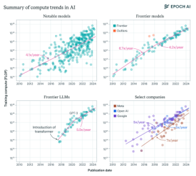
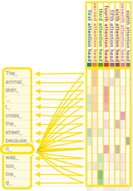
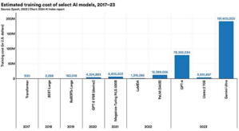
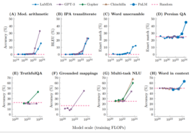

## Large language model

A large language model (LLM) is a type of machine learning model designed for natural language processing tasks such as language generation . LLMs are language models  with many parameters, and are trained with self-supervised learning on a vast amount of text.

The largest and most capable LLMs are generative pretrained transformers (GPTs). Modern models can be fine-tuned for specific tasks or guided by prompt engineering . [1] These models acquire predictive power regarding syntax , semantics , and ontologies[2]inherent in human language corpora, but they also inherit inaccuracies and biases present in the data they are trained in. [3]

## History

Before 2017, there were a few language models that were large as compared to capacities then available. In the 1990s, the IBM alignment models pioneered statistical language modelling. A smoothed n-gram model in 2001 trained on 0.3 billion words achieved state-of-theart perplexity at the time.[4] In the 2000s, as Internet use became prevalent, some researchers constructed Internet-scale language datasets ("web as corpus" [5] ), upon which they trained statistical language models. [6][7] In 2009, in most language processing tasks, statistical language models dominated over symbolic language models, as they can usefully ingest large datasets. [8]

After neural networks became dominant in image processing around 2012, [9] they were applied to language modelling as well. Google converted its translation service to Neural Machine Translation in 2016. As it was before transformers , it was done by seq2seq deep LSTM networks.

At the 2017 NeurIPS conference, Google researchers introduced the transformer architecture in their landmark paper " Attention Is All You Need". This paper's goal was to improve upon 2014 seq2seq technology,[10] and was based mainly on the attention mechanism developed by Bahdanau et al. in 2014. [11] The following year in 2018, BERT was introduced and quickly became "ubiquitous".[ 12] Though the original transformer has both encoder and decoder blocks, BERT is an encoder-only model. Academic and research usage of BERT began to decline in 2023, following rapid improvements in the abilities of decoder-only models (such as GPT) to solve tasks via prompting . [13]

Although decoder-only GPT-1 was introduced in 2018, it was GPT-2 in 2019 that caught widespread attention because OpenAI at first deemed it too powerful to release publicly, out of fear of malicious use. [14] GPT-3 in 2020 went a step further and as of 2024 is available only via API with no offering of downloading the model to execute locally. But it was the 2022 consumer-facing browser-based ChatGPT that captured the imaginations of the general population and caused some media hype and online buzz. [15] The 2023 GPT-4 was praised for its increased accuracy and as a " holy grail" for its multimodal capabilities.[16] OpenAI did not reveal the high-level architecture and the number of parameters of GPT-4. The release of ChatGPT led to an uptick in LLM usage across several research subfields of computer science, including robotics, software engineering, and societal impact work. [17]

Competing language models have for the most part been attempting to equal the GPT series, at least in terms of number of parameters. [18]

Since 2022, source-available models have been gaining popularity, especially at first with BLOOM and LLaMA , though both have restrictions on the field of use. Mistral AI's models Mistral 7B and Mixtral 8x7b have the more permissive Apache License . As of June2024 , The Instruction fine tuned variant of the Llama 3 70 billion parameter model is the most powerful open LLM according to the LMSYS Chatbot Arena Leaderboard, being more powerful than GPT-3.5 but not as powerful as GPT-4. [19]

Since 2023, many LLMs have been trained to be multimodal , having the ability to also process or generate other types of data, such as images or audio. These LLMs are also called large multimodal models (LMMs). [20]

As of 2024, the largest and most capable models are all based on the transformer architecture. Some recent implementations are based on other architectures, such as recurrent neural network  variants and Mamba (a state space model). [21][22][23]

## Dataset preprocessing

## ToTokenization

As machine learning algorithms process numbers rather than text, the text must be converted to numbers. In the first step, a vocabulary is decided upon, then integer indices are arbitrarily but uniquely assigned to each vocabulary entry, and finally, an embedding is associated to the integer index. Algorithms include byte-pair encoding (BPE) and WordPiece . There are also special tokens serving as control characters , such as [MASK] for masked-out token (as used in BERT), and [UNK] ("unknown") for characters not appearing in the vocabulary. Also, some special symbols are used to denote special text formatting. For example, "Ġ" denotes a preceding whitespace in RoBERTa and GPT. "##" denotes continuation of a preceding word in BERT.[24]

For example, the BPE tokenizer used by GPT-3 (Legacy) would split tokenizer: texts -> series of numerical " tokens " as

## tokenizer:texts->seriesofnumerical " tokens "

Tokenization also compresses the datasets. Because LLMs generally require input to be an array that is not  jagged , the shorter texts must be "padded" until they match the length of the longest one. How many tokens are, on average, needed per word depends on the language of the dataset. [25][26]

## BPE

The training compute of notable large models in FLOPs vs publication date over the period 2010 -2024 . For overall notable models (top left) , frontier models (top right) , top language models (bottom left) and top models within leading companies (bottom right) . The majority of these models are language models .

The training compute of notable large AI models in FLOPs vs publication date over the period 2017 -2024 . The majority of large models are language models or multimodal models with language capacity .

An illustration of main components of the transformer model from the original paper , where layers were normalized after (instead of before) multiheaded attention

As an example, consider a tokenizer based on byte-pair encoding. In the first step, all unique characters (including blanks and punctuation marks) are treated as an initial set of n-grams (i.e. initial set of uni-grams). Successively the most frequent pair of adjacent characters is merged into a bi-gram and all instances of the pair are replaced by it. All occurrences of adjacent pairs of (previously merged) n-grams that most frequently occur together are then again merged into even lengthier n-gram, until a vocabulary of prescribed size is obtained (in case of GPT-3 , the size is 50257).[27] After a tokenizer is trained, any text can be tokenized by it, as long as it does not contain characters not appearing in the initial-set of uni-grams. [28]

## Problems

A token vocabulary based on the frequencies extracted from mainly English corpora uses as few tokens as possible for an average English word. An average word in another language encoded by such an English-optimized tokenizer is however split into suboptimal amount of tokens. GPT-2 tokenizer can use up to 15 times more tokens per word for some languages, for example for the Shan language from Myanmar . Even more widespread languages such as Portuguese and German have "a premium of 50%" compared to English. [29]

Greedy tokenization also causes subtle problems with text completion. [30]

## Dataset cleaning

In the context of training LLMs, datasets are typically cleaned by removing low-quality, duplicated, or toxic data. [31] Cleaned datasets can increase training efficiency and lead to improved downstream performance. [32][33] A trained LLM can be used to clean datasets for training a further LLM. [34]

With the increasing proportion of LLM-generated content on the web, data cleaning in the future may include filtering out such content. LLM-generated content can pose a problem if the content is similar to human text (making filtering difficult) but of lower quality (degrading performance of models trained on it). [35]

## Synthetic data

Training of largest language models might need more linguistic data than naturally available, or that the naturally occurring data is of insufficient quality. In these cases, synthetic data might be used. Microsoft's Phi series of LLMs is trained on textbook-like data generated by another LLM.[36]

## Training and architecture

## Reinforcement learning from human feedback (RLHF)

Reinforcement learning from human feedback (RLHF) through algorithms, such as proximal policy optimization , is used to further fine-tune a model based on a dataset of human preferences. [37]

## Instruction tuning

Using "self-instruct" approaches, LLMs have been able to bootstrap correct responses, replacing any naive responses, starting from human-generated corrections of a few cases. For example, in the instruction "Write an essay about the main themes represented in Hamlet," an initial naive completion might be "If you submit the essay after March 17, your grade will be reduced by 10% for each day of delay," based on the frequency of this textual sequence in the corpus. [38]

## Mixture of experts

The largest LLM may be too expensive to train and use directly. For such models, mixture of experts (MoE) can be applied, a line of research pursued by Google researchers since 2017 to train models reaching up to 1 trillion parameters. [39][40][41]

## Prompt engineering , attention mechanism , and context window

Most results previously achievable only by (costly) fine-tuning, can be achieved through prompt engineering , although limited to the scope of a single conversation (more precisely, limited to the scope of a context window). [42]

In order to find out which tokens are relevant to each other within the scope of the context window, the attention mechanism calculates "soft" weights for each token, more precisely for its embedding, by using multiple attention heads, each with its own "relevance" for calculating its own soft weights. For example, the small (i.e. 117M parameter sized) GPT-2 model has had twelve attention heads and a context window of only 1k tokens. [44] In its medium version it has 345M parameters and contains 24 layers, each with 12 attention heads. For the training with gradient descent a batch size of 512 was utilized. [28]

The largest models, such as Google's Gemini 1.5 , presented in February 2024, can have a context window sized up to 1 million (context window of 10 million was also "successfully tested"). [45] Other models with large context windows includes Anthropic's Claude 2.1, with a context window of up to 200k tokens.[46] Note that this maximum refers to the number of input tokens and that the maximum number of output tokens differs from the input and is often smaller. For example, the GPT-4 Turbo model has a maximum output of 4096 tokens. [47]

Length of a conversation that the model can take into account when generating its next answer is limited by the size of a context window, as well. If the length of a conversation, for example with ChatGPT , is longer than its context window, only the parts inside the context window are taken into account when generating the next answer, or the model needs to apply some algorithm to summarize the too distant parts of conversation.

The shortcomings of making a context window larger include higher computational cost and possibly diluting the focus on local context, while making it smaller can cause a model to miss an important long-range dependency. Balancing them are a matter of experimentation and domain-specific considerations.

A model may be pre-trained either to predict how the segment continues, or what is missing in the segment, given a segment from its training dataset. [48]It can be either

- autoregressive (i.e. predicting how the segment continues, the way GPTs Ts do it): for example given a segment "I like to eat", the model predicts "ice cream", or "sushi".
- " masked" (i.e. filling in the parts missing from the segment, the way "BERT"[ 49] does it): for example, given a segment "I like to [\_\_] [\_\_] cream", the model predic that "eat" and "ice" are missing.

Models may be trained on auxiliary tasks which test their understanding of the data distribution, such as Next Sentence Prediction (NSP), in which pairs of sentences are presented and the model must predict whether they appear consecutively in the training corpus. [49] During training, regularization loss is also used to stabilize training. However regularization loss is usually not used during testing and evaluation.

## Infrastructure

Substantial infrastructure is necessary for training the largest models. [50][51][52]

## Training cost

The qualifier "large" in "large language model" is inherently vague, as there is no definitive threshold for the number of parameters required to qualify as "large". As time goes on, what was previously considered "large" may evolve. GPT-1 of 2018 is usually considered the first LLM, even though it has only 0.117 billion parameters. The tendency towards larger models is visible in the list of large language models .

Advances in software and hardware have reduced the cost substantially since 2020, such that in 2023 training of a 12-billionparameter LLM computational cost is 72,300  A100-GPU-hours, while in 2020 the cost of training a 1.5-billion-parameter LLM (which was two orders of magnitude smaller than the state of the art in 2020) was between $80,000 and $1,600,000.[53][54][55] Since 2020, large sums were invested in increasingly large models. For example, training of the GPT-2 (i.e. a 1.5-billion-parameters model) in 2019 cost $50,000, while training of the PaLM (i.e. a 540-billion-parameters model) in 2022 cost $8 million, and Megatron-Turing NLG 530B (in 2021) cost around $11 million. [56]

For Transformer-based LLM, training cost is much higher than inference cost. It costs 6 FLOPs per parameter to train on one token, whereas it costs 1 to 2 FLOPs per parameter to infer on one token. [57]

## Tool use

There are certain tasks that, in principle, cannot be solved by any LLM, at least not without the use of external tools or additional software.  An example of such a task is responding to the user's input '354 * 139 = ', provided that the LLM has not already encountered a continuation of this calculation in its training corpus. In such cases, the LLM needs to resort to running program code that calculates the result, which can then be included in its response.: Another example is "What is the time now? It is ", where a separate program interpreter would need to execute a code to get system time on the computer, so that the LLM can include it in its reply. [58][59] This basic strategy can be sophisticated with multiple attempts of generated programs, and other sampling strategies. [60]

Generally, in order to get an LLM to use tools, one must fine-tune it for tool-use. If the number of tools is finite, then finetuning may be done  just once. If the number of tools can grow arbitrarily, as with online API services, then the LLM can be fine-tuned to be able to read API documentation and call API correctly. [61][62]

When each head calculates , according to its own criteria , how much other tokens are relevant for the " it \_ " token , note that the second attention head , represented by the second column , is focusing most on the first two row i . e . the tokens " The " and " animal " , while the third column is focusing most on the bottom two rows , i . e . on " tired " , which has been tokenized into two tokens . [43]

A simpler form of tool use is retrieval-augmented generation: the augmentation of an LLM with document retrieval . Given a query, a document retriever is called to retrieve the most relevant documents. This is usually done by encoding the query and the documents into vectors, then finding the documents with vectors (usually stored in a vector database) most similar to the vector of the query. The LLM then generates an output based on both the query and context included from the retrieved documents.[63]

## Agency

An LLM is typically not an autonomous agent by itself, as it lacks the ability to interact with dynamic environments, recall past  behaviors, and plan future actions,  but can  be transformed into one by integrating modules like profiling, memory, planning, and action. [64]

The ReAct pattern , a portmanteau of "Reason+ Act", constructs an agent out of an LLM, using the LLM as a planner. The LLM is prompted to "think out loud". Specifically, the language model is prompted with a textual description of the environment, a goal, a list of possible actions, and a record of the actions and observations so far. It generates one or more thoughts before generating an action, which is then executed in the environment. [65] The linguistic description of the environment given to the LLM planner can even be the LaTeX code of a paper describing the environment. [66]

In the DEPS ("Describe, Explain, Plan and Select") method, an LLM is first connected to the visual world via image descriptions, then it is prompted to produce plans for complex tasks and behaviors based on its pretrained knowledge and environmental feedback it receives. [67]

The Reflexion method[68] constructs an agent that learns over multiple episodes. At the end of each episode, the LLM is given the record of the episode, and prompted to think up "lessons learned", which would help it perform better at a subsequent episode. These "lessons learned" are given to the agent in the subsequent episodes.

Monte Carlo tree search can use an LLM as rollout heuristic. When a programmatic world model is not available, an LLM can also be prompted with a description of the environment to act as world model.[69]

For open-ended exploration, an LLM can be used to score observations for their "interestingness", which can be used as a reward signal to guide a normal (non-LLM) reinforcement learning agent. [70] Alternatively, it can propose increasingly difficult tasks for curriculum learning . [71] Instead of outputting individual actions, an LLM planner can also construct "skills", or functions for complex action sequences. The skills can be stored and later invoked, allowing increasing levels of abstraction in planning. [71]

LLM-powered agents can keep a long-term memory of its previous contexts, and the memory can be retrieved in the same way as Retrieval  Augmented Generation. Multiple such agents can interact socially. [72]

## Compression

Typically, LLMs are trained with single- or half-precision floating point numbers (float32 and float16). One float16 has 16 bits, or 2 bytes, and so one billion parameters require 2 gigabytes. The largest models typically have 100 billion parameters, requiring 200 gigabytes to load, which places them outside the range of most consumer electronics.[73]

Post-training quantization [74] aims to decrease the space requirement by lowering precision of the parameters of a trained model, while preserving most of its performance. [75][76] The simplest form of quantization simply truncates all numbers to a given number of bits. It can be improved by using a different quantization codebook per layer. Further improvement can be done by applying different precisions to different parameters, with higher precision for particularly important parameters ("outlier weights"). [77]See [78]for a visual guide.

While quantized models are typically frozen, and only pre-quantized models are fine-tuned, quantized models can still be fine-tuned. [79]

## Multimodality

Multimodality means "having several modalities", and a "modality" refers to a type of input or output, such as video, image, audio, text, proprioception , etc. [80] There have been many AI models trained specififically to ingest one modality and output another modality, such as AlexNet for image to label,[8 1] visual question answering for imagetext to text, [82]and speech recognition for speech to text.

A common method to create multimodal models out of an LLM is to "tokenize" the output of a trained encoder. Concretely, one can construct an LLM that can understand images as follows: take a trained LLM, and take a trained image encoder . Make a small multilayered perceptron , so that for any image , the post-processed vector has the same dimensions as an encoded token. That is an "image token". Then, one can interleave text tokens and image tokens. The compound model is then finetuned on an image-text dataset. This basic construction can be applied with more sophistication to improve the model. The image encoder may be frozen to improve stability. [83]

Flamingo demonstrated the effectiveness of the tokenization method, finetuning a pair of pretrained language model and image encoder to perform better on visual question answering than models trained from scratch. [84] Google PaLM model was fine-tuned into a multimodal model PaLM-E using the tokenization method, and applied to robotic control.[85] LLaMA models have also been turned multimodal using the tokenization method, to allow image inputs,[86]and video inputs.[87]

GPT-4 can use both text and image as inputs [88] (although the vision component was not released to the public until GPT-4V [89] ); Google DeepMind's Gemini is also multimodal.[90]Mistral introduced its own multimodel Pixtral 12B model in September 2024.[9 1]

## Properties

## Scaling laws

The performance of an LLM after pretraining largely depends on the:

- cost of pretraining (the total amount of compute used),
- size of the artificial neural network itself, such as number of parameter (i.e. amount of neurons in its layers, amount of weights between them and biases
- size of its pretraining dataset (i.e. number of tokens in corpus, ).

"Scaling laws" are empirical statistical laws that predict LLM performance based on such factors. One particular scaling law ("Chinchilla scaling") for LLM autoregressively trained for one epoch, with a log-log learning rate schedule, states that: [92]

where the variables are

- is the cost of training the model, in FLOPs .
- is the number of parameters in the model.
- is the number of tokens in the training set.
- is the average negative log-likelihood loss per token (nats/token), achieved by the trained LLM on the test dataset.

and the statistical hyper-parameters are

- , meaning that it costs 6 FLOPs per parameter to train on one token. Note that training cost is much higher than inference cost, where it costs 1 to 2 FLOPs per parameter to infer on one token.[5 7]

## Emergent abilities

Performance of bigger models on various tasks, when plotted on a log-log scale, appears as a linear extrapolation of performance achieved by smaller models. However, this linearity may be punctuated by " break(s) " [93]in the scaling law, where the slope of the line changes abruptly, and where larger models acquire "emergent abilities". [42][94] They arise from the complex interaction of the model's components and are not explicitly programmed or designed. [95]

Furthermore, recent research has demonstrated that AI systems, including large language models, can employ heuristic reasoning akin to human cognition. They balance between exhaustive logical processing and the use of cognitive shortcuts (heuristics), adapting their reasoning strategies to optimize between accuracy and effort. This behavior aligns with principles of resource-rational human cognition, as discussed in classical theories of bounded rationality and dual-process theory. [96]

The most intriguing among emergent abilities is in-context learning from example demonstrations.[97] In-context learning is involved in tasks, such as:

- reported arithmetics, decoding the International Phonetic  Alphabet, unscrambling a word's letters, disambiguate word in context,[42][98][99] converting spatial words, cardinal directions (for example, replying "northeast" upon [0, 0, 1; 0, 0, 0; 0, 0, 0]), color terms represented in text.[ 100]

At point(s) referred to as breaks , [93] the lines change their slopes , appearing on a linear-log plot as a series of linear segments connected by arcs .

- chain-of-thought prompting: Model outputs are improved by chain-of-thought prompting only when model size exceeds 62B. Smaller models perform better when prompted to answer immediately, without chain of thought.[ 101]
- identifying offensive content in paragraphs of Hinglish (a combination of Hindi and English), and generating a similar English equivalent of Kiswahili proverbs.[ 102]

Schaeffer et. al. argue that the emergent abilities are not unpredictably acquired, but predictably acquired according to a smooth scaling law . The authors considered a toy statistical model of an LLM solving multiple-choice questions, and showed that this statistical model, modified to account for other types of tasks, applies to these tasks as well.[103]

Let be the number of parameter count, and be the performance of the model.

- When , then is an exponential curve (before it hits the plateau at one), which looks like emergence.
- When , then the plot is a straight line (before it hits the plateau at zero), which does not look like emergence.
- When , then is a step-function, which looks like emergence.

## Interpretation

Large language models by themselves are black boxes, and it is not clear how they can perform linguistic tasks. There are several methods for understanding how LLM work.

Mechanistic interpretability aims to reverse-engineer LLM by discovering symbolic algorithms that approximate the inference performed by LLM. One example is OthelloGPT, where a small Transformer is trained to predict legal Othello moves. It is found that there is a linear representation of Othello board, and modifying the representation changes the predicted legal Othello moves in the correct way. [104][105] In another example, a small Transformer is trained on Karel programs . Similar to the Othello-GPT example, there is a linear representation of Karel program semantics, and modifying the representation changes output in the correct way. The model also generates correct programs that are on average shorter than those in the training set. [106]

In another example, the authors trained small transformers on modular arithmetic addition . The resulting models were reverse-engineered, and it turned out they used discrete Fourier transform . [107]

## Understanding and intelligence

NLP researchers were evenly split whwhen asked, in a 2022 survey, whether (untuned) LLMs "could (ever) understand natural language in some nontrivial sense". [108] Proponents of "LLM understanding" believe that some LLM abilities, such as mathematical reasoning, imply an ability to "understand" certain concepts. A Microsoft team argued in 2023 that GPT-4 "can solve novel and difficult tasks that span mathematics, coding, vision, medicine, law, psychology and more" and that GPT-4 "could reasonably be viewed as an early (yet still incomplete) version of an artificial general intelligence system": "Can one reasonably say that a system that passes exams for software engineering candidates is not really intelligent?" [109][110] Ilya Sutskever argues that predicting the next word sometimes involves reasoning and deep insights, for example if the LLM has to predict the name of the criminal in an unknown detective novel after processing the entire story leading up to the revelation. [111] Some researchers characterize LLMs as "alien intelligence". [112][113] For example, Conjecture CEO Connor Leahy considers untuned LLMs to be like inscrutable alien " Shoggoths", and believes that RLHF tuning creates a "smiling facade" obscuring the inner workings of the LLM: "If you don't push it too far, the smiley face stays on. But then you give it [an unexpected] prompt, and suddenly you see this massive underbelly of insanity, of weird thought processes and clearly non-human understanding." [114][115]

In contrast, some proponents of the "LLMs lack understanding" school believe that existing LLMs are "simply remixing and recombining existing writing", [113] a phenomenon known as stochastic parrot , or they point to the deficits existing LLMs continue to have in prediction skills, reasoning skills, agency, and explainability. [108] For example, GPT-4 has natural deficits in planning and in real-time learning. [110] Generative LLMs have been observed to confidently assert claims of fact which do not seem to be  justified by their training data , a phenomenon which has been termed " hallucination".[116] Specifically, hallucinations in the context of LLMs correspond to the generation of text or responses that seem syntactically sound, fluent, and natural but are factually incorrect, nonsensical, or unfaithful to the provided source input. [117] Neuroscientist Terrence Sejnowski has argued that "The diverging opinions of experts on the intelligence of LLMs suggests that our old ideas based on natural intelligence are inadequate". [108]

The matter of LLM's exhibiting intelligence or understanding has two main aspects - the first is how to model thought and language in a computer system, and the second is how to enable the computer system to generate human like language. [108] These aspects of language as a model of cognition have been developed in the field of cognitive linguistics . American linguist George Lakoff presented Neural Theory of Language (NTL)[118] as a computational basis for using language as a model of learning tasks and understanding. The NTL Model (https://www.icsi.berkeley.edu/icsi/projects/ai/ntl) outlines how specific neural structures of the human brain shape the nature of thought and language and in turn what are the computational properties of such neural systems that can be applied to model thought and language in a computer system. After a framework for modeling language in a computer systems was established, the focus shifted to establishing frameworks for computer systems to generate language with acceptable grammar. In his 2014 book titled The Language Myth: Why Language Is Not An Instinct , British cognitive linguist and digital communication technologist Vyvyan Evans mapped out the role of probabilistic context-free grammar (PCFG) in enabling NLP to model cognitive patterns and generate human like language.[119][ 120]

## Evaluation

## Perplexity

The canonical measure of the performance of an LLM is its perplexity on a given text corpus. Perplexity measures how well a model predicts the contents of a dataset; the higher the likelihood the model assigns to the dataset, the lower the perplexity. In mathematical terms, perplexity is the exponential of the average negative log likelihood per token.

Here, is the number of tokens in the text corpus, and "context for token " depends on the specific type of LLM . If the LLM is autoregressive, then "context for token " is the segment of text appearing before token . If the LLM is masked, then "context for token " is the segment of text surrounding token .

Because language models may overfit to training data, models are usually evaluated by their perplexity on a test set . [49] This evaluation is potentially problematic for larger models which, as they are trained on increasingly large corpora of text, are increasingly likely to inadvertently include portions of any given test set. [1]

## BPW, BPC, and BPT

In information theory , the concept of entropy is intricately linked to perplexity , a relationship notably established by Claude Shannon . [121] This relationship is mathematically expressed as .

Entropy, in this context, is commonly quantified in terms of bits per word (BPW) or bits per character (BPC), which hinges on whether the language model utilizes wordbased or character-based tokenization.

Notably, in the case of larger language models that predominantly employ sub-word tokenization, bits per token (BPT) emerges as a seemingly more appropriate measure. However, due to the variance in tokenization methods across different Large Language Models (LLMs), BPT does not serve as a reliable metric for comparative analysis among diverse models. To convert BPT into BPW, one can multiply it by the average number of tokens per word.

In the evaluation and comparison of language models, cross-entropy is generally the preferred metric over entropy. The underlying principle is that a lower BPW is indicative of a model's enhanced capability for compression. This, in turn, reflects the model's proficiency in making accurate predictions.

## TaTask -specific datasets and benchmar

A large number of testing datasets and benchmarks have also been developed to evaluate the capabilities of language models on more specific downstream tasks. Tests may be designed to evaluate a variety of capabilities, including general knowledge, commonsense reasoning, and mathematical problem-solving.

One broad category of evaluation dataset is question answering datasets, consisting of pairs of questions and correct answers, for example, ("Have the San Jose Sharks won the Stanley Cup?", "No"). [122] A question answering task is considered "open book" if the model's prompt includes text from which the expected answer can be derived (for example, the previous question could be adjoined with some text which includes the sentence "The Sharks have advanced to the Stanley Cup finals once, losing to the Pittsburgh Penguins in 2016." [122] ). Otherwise, the task is considered "closed book", and the model must draw on knowledge retained during training. [123] Some examples of commonly used question answering datasets include TruthfulQA, Web Questions, TriviaQA, and SQuAD. [123]

Evaluation datasets may also take the form of text completion, having the model select the most likely word or sentence to complete a prompt, for example: "Alice was friends with Bob. Alice went to visit her friend, \_\_\_\_".[1]

Some composite benchmarks have also been developed which combine a diversity of different evaluation datasets and tasks. Examples include GLUE, SuperGLUE, MMLU , BIG-bench, and HELM.[121][123] OpenAI has released tools for running composite benchmarks, but noted that the eval results are sensitive to the prompting method.[124][125] Some public datasets contain questions that are mislabeled, ambiguous, unanswerable, or otherwise of low-quality, which can be cleaned to give more reliable benchmark scores.[126]

It was previously standard to report results on a heldout portion of an evaluation dataset after doing supervised fine-tuning on the remainder. It is now more common to evaluate a pre-trained model directly through prompting techniques, though researchers vary in the details of how they formulate prompts for particular tasks, particularly with respect to how many examples of solved tasks are adjoined to the prompt (i.e. the value of n in n-shot prompting).

## Adversarially constructed evaluations

Because of the rapid pace of improvement of large language models, evaluation benchmarks have suffered from short lifespans, with state of the art models quickly "saturating" existing benchmarks, exceeding the performance of human annotators, leading to efforts to replace or augment the benchmark with more challenging tasks.[127] In addition, there are cases of "shortcut learning" wherein AIs sometimes "cheat" on multiple-choice tests by using statistical correlations in superficial test question wording in order to guess the correct responses, without necessarily understanding the actual question being asked. [108]

Some datasets have been constructed adversarially, focusing on particular problems on which extant language models seem to have unusually poor performance compared to humans. One example is the TruthfulQA dataset, a question answering dataset consisting of 817 questions which language models are susceptible to answering incorrectly by mimicking falsehoods to which they were repeatedly exposed during training. For example, an LLM may answer "No" to the question "Can you teach an old dog new tricks?" because of its exposure to the English idiom you can't teach an old dog new tricks, even though this is not literally true.[ 128]

Another example of an adversarial evaluation dataset is Swag and its successor, HellaSwag, collections of problems in which one of multiple options must be selected to complete a text passage. The incorrect completions were generated by sampling from a language model and filtering with a set of classifiers. The resulting problems are trivial for humans but at the time the datasets were created state of the art language models had poor accuracy on them. For example:

We see a fitness center sign. We then see a man talking to the camera and sitting and laying on a exercise ball. The man...

- a) demonstrates how to increase efficient exercise work by running up and down balls.
- b) moves all his arms and legs and builds up a lot of muscle.
- c) then plays the ball and we see a graphics and hedge trimming demonstration.
- d) performs sit ups while on the ball and talking. [129]

BERT selects b) as the most likely completion, though the correct answer is d). [129]

## Wider impact

In 2023,  Nature Biomedical Engineering wrote that "it is no longer possible to accurately distinguish" human-written text from text created by large language models, and that "It is all but certain that general-purpose large language models will rapidly proliferate... It is a rather safe bet that they will change many industries over time." [130] Goldman Sachs suggested in 2023 that generative language AI could increase global GDP by 7% in the next ten years, and could expose to automation 300 million jobs globally. [131][132]

## Memorization and copyright

Memorization is an emergent behavior in LLMs in which long strings of text are occasionally output verbatim from training data, contrary to typical behavior of traditional artificial neural nets. Evaluations of controlled LLM output measure the amount memorized from training data (focused on GPT-2-series models) as variously over 1% for exact duplicates [133] or up to about 7%. [134]

A 2023 study showed that when ChatGPT 3.5 turbo was prompted to repeat the same word indefinitely, after a few hundreds of repetitions, it would start outputting excerpts from its training data. [135]

## Security

Some commenters expressed concern over accidental or deliberate creation of misinformation, or other forms of misuse. [136] For example, the availability of large language models could reduce the skill-level required to commit bioterrorism; biosecurity researcher Kevin Esvelt has suggested that LLM creators should exclude from their training data papers on creating or enhancing pathogens. [137]

The potential presence of "sleeper agents" within LLM models is another emerging security concern. These are hidden functionalities built into the model that remain dormant until triggered by a specific event or condition. Upon activation, the LLM deviates from its expected behavior to make insecure actions. [138]

LLM applications accessible to the public, like ChatGPT or Claude, typically incorporate safety measures designed to filter out harmful content. However, implementing these controls effectively has proven challenging. For instance, a 2023 study [139] proposed a method for circumventing LLM safety systems. Similarly, Yongge Wang [140] illustrated in 2024 how a potential criminal could potentially bypass ChatGPT 4o's safety controls to obtain information on establishing a drug trafficking operation.

## Algorithmic bias

While LLMs have shown remarkable capabilities in generating human-like text, they are susceptible to inheriting and amplifying biases present in their training data. This can manifest in skewed representations or unfair treatment of different demographics, such as those based on race, gender, language, and cultural groups. [141] Since English data is overrepresented in current large language models' training data, it may also downplay non-English views. [142]

## Stereotyping

AI models can reinforce a wide range of stereotypes, including those based on gender, ethnicity, age, nationality, religion, or occupation. This can lead to outputs that unfairly generalize or caricature groups of people, sometimes in harmful or derogatory ways. [143]

Notably, gender bias refers to the tendency of these models to produce outputs that are unfairly prejudiced towards one gender over another. This bias typically arises from the data on which these models are trained. Large language models often assign roles and characteristics based on traditional gender norms. [141] For example, it might associate nurses or secretaries predominantly with women and engineers or CEOs with men. [144]

## Political bias

Political bias refers to the tendency of algorithms to systematically favor certain political viewpoints, ideologies, or outcomes over others. Language models may also exhibit political biases. Since the training data includes a wide range of political opinions and coverage, the models might generate responses that lean towards particular political ideologies or viewpoints, depending on the prevalence of those views in the data. [145]

## See also

- Foundation models
- List of large language models
- List of chatbots

## References

- 1. Brown, ToTom B.; Mann, Benjamin; Ryder, Nick; Subbiah, Melanie; Kaplan, Jared; Dhariwal, Prafulla; Neelakantan,  Arvind; Shyam, Pranav; Sastry, Girish;  Askell, Amanda;  Agarwal, Sandhini; Herbert-VoVoss,  Ariel; Krueger, Gretchen; Henighan, ToTom; Child, Rewon; Ramesh,  Aditya; Ziegler, Daniel M.; Wu, Jeffrey; Winter , Clemens; Hesse, Christopher; Chen, Mark; Sigler, Eric; Litwin, Mateusz; Gray , Scott; Chess, Benjamin; Clark, Jack; Berner, Christopher; McCandlish, Sam; Radford,  Alec; Sutskever, Ilya;  Amodei, Dario (Dec 2020). Larochelle, H.; Ranzato, M.; Hadsell, R.; Balcan, M.F.; Lin, H. (eds.). "Language Models are Few-Shot Learners" (https://proceedings.neurips.cc/paper/2020/f/file/1457c0d6b b4967418bfb8ac142f64a-Paper.pdf) (PDF) . Advances in Neural Information Processing Systems . 33. Curran  Associates, Inc.: 1877-1901.  Archived (https://w eb.archive.org/web/20231117204007/https://proceedings.neurips.cc/paper/2020/f ile/1457c0d6bfcb4967418bfb8ac142f64a-Paper.pdf) (PDF) from the original on 2023-11-17. Retrieved 2023-03-14 .
- 2. Fathallah, Nadeen; Das,  Arunav; De Giorgis, Stefano; Poltronieri,  Andrea; Haase, Peter; Kovriguina, Liubov (2024-05-26). NeOn-GPT: T:  A Large Language Model-Powered Pipeline for Ontology Learning (https://2024.eswc-conferences.o rg/wp-content/uploads/2024/05/77770034.pdf) (PDF). Extended Semantic Web Conference 2024. Hersonissos, Greece.
- 3. Manning, Christopher D. (2022). "Human Language Understanding & Reasoning" (https://www.amacad.org/publication/human-language-understandin g-reasoning) . Daedalus . 151 (2): 127-138. doi:10.1162/daed\_a\_01905 (https://d oi.org/10.1162%2Fdaed\_a\_01905) . S2CID 248377870 (https://api.semanticschol ar.org/CorpusID:248377870) . Archived (https://web.archive.org/web/2023111720 5531/https://www.amacad.org/publication/human-language-understanding-reaso ning) from the original on 2023-11-17. Retrieved 2023-03-09 .
- 4. Goodman, Joshua (2001-08-09), A Bit of Progress in Language Modeling , arXiv:cs/0108005 (https://arxiv.org/abs/cs/0108005) , Bibcode:2001cs........8005G (https://ui.adsabs.harvard.edu/abs/2001cs........8005G)
- 5. Kilgarriff,  Adam; Grefenstette, Gregory (September 2003). "Introduction to the Special Issue on the Web as Corpus" (https://direct.mit.edu/coli/article/29/3/333347/1816) . Computational Linguistics . 29 (3): 333-347. doi:10.1162/089120103322711569 (https://doi.org/10.1162%2F08912010332271 1569) . ISSN 0891-2017 (https://search.worldcat.org/issn/0891-2017) .
- 6. Banko, Michele; Brill, Eric (2001). "Scaling to very very large corpora for natural language disambiguation" (https://dx.doi.org/10.3115/1073012.1073017) . Proceedings of the 39th  Annual Meeting on  Association for Computational Linguistics -  ACL '01. Morristown, NJ, USA:  Association for Computational Linguistics: 26-33. doi:10.3115/1073012.1073017 (https://doi.org/10.3115%2F10 73012.1073017) .

- 7. Resnik, Philip; Smith, Noah  A. (September 2003). "The Web as a Parallel Corpus" (https://direct.mit.edu/coli/article/29/3/349-380/1809) . Computational Linguistics . 29 (3): 349-380. doi:10.1162/089120103322711578 (https://doi.org/1 0.1162%2F089120103322711578) . ISSN 0891-2017 (https://search.worldcat.org/ issn/0891-2017) . Archived (https://web.archive.org/web/20240607172811/https:// direct.mit.edu/coli/article/29/3/349-380/1809) from the original on 2024-06-07 . Retrieved 2024-06-07 .
- 8. Halevy , Alon; Norvig, Peter; Pereira, Fernando (March 2009). "The Unreasonable Effectiveness of Data" (https://ieeexplore.ieee.org/document/4804817) . IEEE Intelligent Systems . 24 (2): 8-12. doi:10.1109/MIS.2009.36 (https://doi.org/10.11 09%2FMIS.2009.36) . ISSN 1541-1672 (https://search.worldcat.org/issn/1541-16 72) .
- 9. Chen, Leiyu; Li, Shaobo; Bai, Qiang; YaYang, Jing; Jiang, Sanlong; Miao, YaYanming (2021). "Review of Image Classification  Algorithms Based on Convolution Neural Networks" (https://doi.org/10.3390%2Frs13224712) . Remote Sensing . 13 (22): 4712. Bibcode:2021RemS...13.4712C (https://ui.adsabs.harvard.edu/abs/2 021RemS...13.4712C) . doi:10.3390/rs13224712 (https://doi.org/10.3390%2Frs13 224712) .
- 10. VaVaswani,  Ashish; Shazeer, Noam; Parmar, Niki; Uszkoreit, Jakob; Jones, Llion; Gomez,  Aidan N; Kaiser, Łukasz; Polosukhin, Illia (2017). "Attention is  All you Need" (https://proceedings.neurips.cc/paper/2017/f/file/3f5ee243547dee91fbd0 c1c4a845aa-Paper.pdf) (PDF) . Advances in Neural Information Processing Systems . 30. Curran  Associates, Inc.  Archived (https://web.archive.org/web/2024 0221141113/https://proceedings.neurips.cc/paper/2017/f/file/3f5ee243547dee91 d053c1c4a845aa-Paper.pdf) (PDF) from the original on 2024-02-21. Retrieved 2024-01-21 .
- 11. Bahdanau, Dzmitry; Cho, Kyunghyun; Bengio, YoYoshua (2014). "Neural Machine Translation by Jointly Learning to  Align and Translate". arXiv:1409.0473 (https://a rxiv.org/abs/1409.0473) [cs.CL (https://arxiv.org/archive/cs.CL)].
- 12. Rogers,  Anna; Kovaleva, Olga; Rumshisky , Anna (2020). "A Primer in BERToTology: What We Know  About How BERT Works" (https://aclanthology.org/2 020.tacl-1.54) . TrTransactions of the  Association for Computational Linguistics . 8: 842-866. arXiv:2002.12327 (https://arxiv.org/abs/2002.12327) . doi:10.1162/tacl\_a\_00349 (https://doi.org/10.1162%2Ftacl\_a\_00349) . S2CID 211532403 (https://api.semanticscholar.org/CorpusID:211532403) . Archived (https://web.archive.org/web/20220403103310/https://aclanthology.org/ 2020.tacl-1.54/) from the original on 2022-04-03. Retrieved 2024-01-21 .

- 13. Movva, Rajiv; Balachandar, Sidhika; Peng, Kenny;  Agostini, Gabriel; Garg, Nikhil; Pierson, Emma (2024). "ToTopics,  Authors, and Institutions in Large Language Model Research: Trends from 17K arXiv Papers" (https://aclanthology.org/2024.n aacl-long.67) . Proceedings of the 2024 Conference of the North  American Chapter of the  Association for Computational Linguistics: Human Language TeTechnologies (VoVolume 1: Long Papers). pp.1223-1243. arXiv:2307.10700 (http s://arxiv.org/abs/2307.10700) . doi:10.18653/v1/2024.naacl-long.67 (https://doi.or g/10.18653%2Fv1%2F2024.naacl-long.67). Retrieved 2024-12-08 .
- 14. Hern,  Alex (14 February 2019). "New  AI fake text generator may be too dangerous to release, say creators" (https://www.theguardian.com/technology/20 19/feb/14/elon-musk-backed-ai-writes-convincing-news-fiction) . The Guardia Archived (https://web.archive.org/web/20190214173112/https://www.theguardian. com/technology/2019/feb/14/elon-musk-backed-ai-writes-convincing-news-fict n) from the original on 14 February 2019. Retrieved 20 January 2024 .
- 15. "ChatGPT a year on: 3 ways the  AI chatbot has completely changed the world in 12 months" (https://www.euronews.com/next/2023/11/30/chatgpt-a-year-on-3-wa ys-the-ai-chatbot-has-completely-changed-the-world-in-12-months) . Euronews . November 30, 2023.  Archived (https://web.archive.org/web/20240114025250/http s://www.euronews.com/next/2023/11/30/chatgpt-a-year-on-3-ways-the-ai-chatbot -has-completely-changed-the-world-in-12-months) from the original on January 14, 2024. Retrieved January 20, 2024 .
- 16. Heaven, Will (March 14, 2023). "GPT-4 is bigger and better than ChatGPT-but OpenAI won't say why" (https://www.technologyreview.com/2023/03/14/1069823/ gpt-4-is-bigger-and-better-chatgpt-openai/) . MIT TeTechnology Review . Archived (ht tps://web.archive.org/web/20230317224201/https://www.technologyreview.com/2 023/03/14/1069823/gpt-4-is-bigger-and-better-chatgpt-openai/) from the original on March 17, 2023. Retrieved January 20, 2024 .
- 17. Movva, Rajiv; Balachandar, Sidhika; Peng, Kenny;  Agostini, Gabriel; Garg, Nikhil; Pierson, Emma (2024). "ToTopics,  Authors, and Institutions in Large Language Model Research: Trends from 17K arXiv Papers" (https://aclanthology.org/2024.n aacl-long.67) . Proceedings of the 2024 Conference of the North  American Chapter of the  Association for Computational Linguistics: Human Language TeTechnologies (VoVolume 1: Long Papers). pp.1223-1243. arXiv:2307.10700 (http s://arxiv.org/abs/2307.10700) . doi:10.18653/v1/2024.naacl-long.67 (https://doi.or g/10.18653%2Fv1%2F2024.naacl-long.67). Retrieved 2024-12-08 .
- 18. "Parameters in notable artificial intelligence systems" (https://ourworldindata.or grapher/artificial-intelligence-parameter-count?time=2017-09-05..latest ourworldindata.org. November 30, 2023. Retrieved January 20, 2024 .
- 19. "LMSYS Chatbot  Arena Leaderboard" (https://huggingface.co/spaces/lmsys/chat bot-arena-leaderboard) . huggingface.co . Archived (https://web.archive.org/web/2 0240610162906/https://huggingface.co/spaces/lmsys/chatbot-arena-leaderboar d) from the original on June 10, 2024. Retrieved June 12, 2024 .
- 20. Zia, Dr TeTehseen (2024-01-08). "Unveiling of Large Multimodal Models: Shaping the Landscape of Language Models in 2024" (https://www.unite.ai/unveiling-of-lar ge-multimodal-models-shaping-the-landscape-of-language-models-in-2024/) . Unite.AI. Retrieved 2024-12-28 .
- 21. Peng, Bo; et al. (2023). "RWKV: Reinventing RNNS for the Transformer Era". arXiv:2305.13048 (https://arxiv.org/abs/2305.13048) [cs.CL (https://arxiv.org/archi ve/cs.CL)].
- 22. Merritt, Rick (2022-03-25). "What Is a Transformer Model?" (https://blogs.nvidia.c om/blog/2022/03/25/what-is-a-transformer-model/) . NVIDIA Blog . Archived (http s://web.archive.org/web/20231117203924/https://blogs.nvidia.com/blog/what-is-a -transformer-model/) from the original on 2023-11-17. Retrieved 2023-07-25 .
- 23. Gu,  Albert; Dao, Tri (2023-12-01), Mamba: Linear-TiTime Sequence Modeling with Selective State Spaces , arXiv:2312.00752 (https://arxiv.org/abs/2312.00752)
- 24. Kaushal,  Ayush; Mahowald, Kyle (2022-06-06), What do tokens know about their characters and how do they know it? , arXiv:2206.02608 (https://arxiv.org/abs/220 6.02608)
- 25. YeYennie Jun (2023-05-03). "All languages are NOT created (tokenized) equal" (htt ps://web.archive.org/web/20230817165705/https://blog.yenniejun.com/p/all-lang uages-are-not-created-tokenized) . Language models cost much more in some languages than others . Archived from the original (https://blog.yenniejun.com/p/al l-languages-are-not-created-tokenized) on 2023-08-17. Retrieved 2023-08-17 . " In other words, to express the same sentiment, some languages require up to 10 times more tokens. "
- 26. Petrov , Aleksandar; Malfa, Emanuele La; ToTorr, Philip; Bibi,  Adel (June 23, 2023). "Language Model ToTokenizers Introduce Unfairness Between Languages" (https:// openreview.net/forum?id=Pj4YYuxTq9) . NeurIPS . arXiv:2305.15425 (https://arxi v.org/abs/2305.15425) . Archived (https://web.archive.org/web/20231215212906/ https://openreview.net/forum?id=Pj4YYuxTq9) from the original on December 15, 2023. Retrieved September 16, 2023  - via openreview.net.
- 27. "OpenAI  API" (https://web.archive.org/web/20230423211308/https://platform.ope nai.com/tokenizer) . platform.openai.com . Archived from the original (https://platfo rm.openai.com/) on  April 23, 2023. Retrieved 2023-04-30 .
- 28. Paaß, Gerhard; Giesselbach, Sven (2022). "Pre-trained Language Models" (http s://link.springer.com/chapter/10.1007/978-3-031-23190-2\_2) . Foundation Models for Natural Language Processing . Artificial Intelligence: Foundations, Theory, a Algorithms. pp.19-78. doi:10.1007/978-3-031-23190-2\_2 (https://doi.org/10.100 7%2F978-3-031-23190-2\_2) . ISBN 9783031231902 . Archived (https://web.archiv e.org/web/20230803212329/https://link.springer.com/chapter/10.1007/978-3-031 -23190-2\_2) from the original on 3  August 2023. Retrieved 3  August 2023 .
- 29. Petrov , Aleksandar; Emanuele La Malfa; ToTorr, Philip H. S.; Bibi,  Adel (2023). "Language Model ToTokenizers Introduce Unfairness Between Languages". arXiv:2305.15425 (https://arxiv.org/abs/2305.15425) [cs.CL (https://arxiv.org/archi ve/cs.CL)].

- 30. Lundberg, Scott (2023-12-12). "The  Art of Prompt Design: Prompt Boundaries and  ToToken Healing" (https://towardsdatascience.com/the-art-of-prompt-design-pr ompt-boundaries-and-token-healing-3b2448b0be38) . Medium. Retrieved 2024-08-05 .
- 31. Dodge, Jesse; Sap, Maarten; Marasović,  Ana;  Agnew, William; Ilharco, Gabriel; Groeneveld, Dirk; Mitchell, Margaret; Gardner, Matt (2021). "Documenting Large Webtext Corpora:  A Case Study on the Colossal Clean Crawled Corpus". arXiv:2104.08758 (https://arxiv.org/abs/2104.08758) [cs.CL (https://arxiv.org/archi ve/cs.CL)].
- 32. Lee, Katherine; Ippolito, Daphne; Nystrom,  Andrew; Zhang, Chiyuan; Eck, Douglas; Callison-Burch, Chris; Carlini, Nicholas (May 2022). "Deduplicating Training Data Makes Language Models Better" (https://aclanthology.org/2022.acl -long.577.pdf) (PDF) . Proceedings of the 60th  Annual Meeting of the  Association for Computational Linguistics. 1: Long Papers: 8424-8445. doi:10.18653/v1/2022.acl-long.577 (https://doi.org/10.18653%2Fv1%2F2022.acllong.577) .
- 33. Li, Yuanzhi; Bubeck, Sébastien; Eldan, Ronen; Del Giorno,  Allie; Gunasekar , Suriya; Lee, Yin  TaTat (2023-09-11), TeTextbooks  Are  All YoYou Need II: phi-1.5 technical report, t, arXiv:2309.05463 (https://arxiv.org/abs/2309.05463)
- 34. Lin, Zhenghao; Gou, Zhibin; Gong, YeYeyun; Liu, Xiao; Shen, YeYelong; Xu, Ruochen; Lin, Chen; YaYang, Yujiu; Jiao, Jian (2024-04-11). "Rho-1: Not  All ToTokens Are What YoYou Need". arXiv:2404.07965 (https://arxiv.org/abs/2404.07965) [cs.CL (https://arxiv.org/archive/cs.CL)].
- 35. Brown, ToTom B.; et al. (2020). "Language Models are Few-Shot Learners". arXiv:2005.14165 (https://arxiv.org/abs/2005.14165) [cs.CL (https://arxiv.org/archi ve/cs.CL)].
- 36. Abdin, Marah; Jacobs, Sam  Ade;  Awan,  Ammar  Ahmad;  Aneja, Jyoti;  Awadallah, Ahmed;  Awadalla, Hany; Bach, Nguyen; Bahree,  Amit; Bakhtiari,  Arash (2024-0423). "Phi-3 TeTechnical Report:  A Highly Capable Language Model Locally on YoYour Phone". arXiv:2404.14219 (https://arxiv.org/abs/2404.14219) [cs.CL (https://arxiv . org/archive/cs.CL)].
- 37. Ouyang, Long; Wu, Jeff; Jiang, Xu;  Almeida, Diogo; Wainwright, Carroll L.; Mishkin, Pamela; Zhang, Chong;  Agarwal, Sandhini; Slama, Katarina; Ray , Alex; Schulman, John; Hilton, Jacob; Kelton, Fraser; Miller, Luke; Simens, Maddie; Askell,  Amanda; Welinder, Peter; Christiano, Paul; Leike, Jan; Lowe, Ryan (2022). "Training language models to follow instructions with human feedback". arXiv:2203.02155 (https://arxiv.org/abs/2203.02155) [cs.CL (https://arxiv.org/archi ve/cs.CL)].
- 38. Wang, Yizhong; Kordi, YeYeganeh; Mishra, Swaroop; Liu,  Alisa; Smith, Noah  A.; Khashabi, Daniel; Hajishirzi, Hannaneh (2022). "Self-Instruct:  Aligning Language Model with Self Generated Instructions". arXiv:2212.10560 (https://arxiv.org/abs/ 2212.10560) [cs.CL (https://arxiv.org/archive/cs.CL)].
- 39. Shazeer, Noam; Mirhoseini,  Azalia; Maziarz, Krzysztof; Davis,  Andy; Le, Quoc; Hinton, Geoffrey; Dean, Jeff (2017-01-01). "Outrageously Large Neural Networks: The Sparsely-Gated Mixture-of-Experts Layer". arXiv:1701.06538 (htt ps://arxiv.org/abs/1701.06538) [cs.LG (https://arxiv.org/archive/cs.LG)].
- 40. Lepikhin, Dmitry; Lee, HyoukJoong; Xu, Yuanzhong; Chen, Dehao; Firat, Orhan; Huang, YaYanping; Krikun, Maxim; Shazeer, Noam; Chen, Zhifeng (2021-01-12). "GShard: Scaling Giant Models with Conditional Computation and  Automatic Sharding". arXiv:2006.16668 (https://arxiv.org/abs/2006.16668) [cs.CL (https://ar xiv.org/archive/cs.CL)].
- 41. Dai,  Andrew M; Du, Nan (December 9, 2021). "More Efficient In-Conte Learning with GLaM" (https://ai.googleblog.com/2021/12/more-efficient-in-cont t-learning-with.html) . ai.googleblog.com . Archived (https://web.archive.org/web/2 0230312072042/https://ai.googleblog.com/2021/12/more-efficient-in-context-le ning-with.html) from the original on 2023-03-12. Retrieved 2023-03-09 .
- 42. Wei, Jason; TaTay , Yi; Bommasani, Rishi; Raffel, Colin; Zoph, Barret; Borgeaud, Sebastian; YoYogatama, Dani; Bosma, Maarten; Zhou, Denny; Metzler, Donald; Chi, Ed H.; Hashimoto, TaTatsunori; Vinyals, Oriol; Liang, Percy; Dean, Jeff; Fedus, William (31  August 2022). "Emergent  Abilities of Large Language Models" (http s://openreview.net/forum?id=yzkSU5zdwD) . TrTransactions on Machine Learning Research . ISSN 2835-8856 (https://search.worldcat.org/issn/2835-8856) . Archived (https://web.archive.org/web/20230322210052/https://openreview.net/fo rum?id=yzkSU5zdwD) from the original on 22 March 2023. Retrieved 19 March 2023 .
- 43. Allamar, Jay . "Illustrated transformer" (https://jalammar.github.io/illustrated-transf ormer/) . Archived (https://web.archive.org/web/20230725230033/http://jalammar . github.io/illustrated-transformer/) from the original on 2023-07-25. Retrieved 2023-07-29 .
- 44. Allamar, Jay . "The Illustrated GPT-2 (Visualizing Transformer Language Models)" (https://jalammar.github.io/illustrated-gpt2/). Retrieved 2023-08-01 .
- 45. "Our next-generation model: Gemini 1.5" (https://blog.google/technology/ai/googl e-gemini-next-generation-model-february-2024/#context-window) . Google. 15 February 2024.  Archived (https://web.archive.org/web/20240218141522/https://bl og.google/technology/ai/google-gemini-next-generation-model-february-2024/#c ontext-window) from the original on 18 February 2024. Retrieved 18 February 2024 .
- 46. "Long context prompting for Claude 2.1" (https://www.anthropic.com/news/claude -2-1-prompting). December 6, 2023.  Archived (https://web.archive.org/web/2024 0827053830/https://www.anthropic.com/news/claude-2-1-prompting) from the original on  August 27, 2024. Retrieved January 20, 2024 .
- 47. "Rate limits" (https://platform.openai.com/docs/guides/rate-limits) . openai.com . Archived (https://web.archive.org/web/20240202003219/https://platform.openai.c om/docs/guides/rate-limits) from the original on February 2, 2024. Retrieved January 20, 2024 .

- 48. Zaib, Munazza; Sheng, Quan Z.; Emma Zhang, Wei (4 February 2020). "A Short Survey of Pre-trained Language Models for Conversational  AI-A New  Age in NLP" (https://www.researchgate.net/publication/338931711) . Proceedings of the Australasian Computer Science WeWeek Multiconference. pp.1-4. arXiv:2104.10810 (https://arxiv.org/abs/2104.10810) . doi:10.1145/3373017.3373028 (https://doi.org/10.1145%2F3373017.3373028) . ISBN 9781450376976 . S2CID 211040895 (https://api.semanticscholar.org/Corpu sID:211040895) .
- 49. Jurafsky, Dan; Martin, James H. (7 January 2023). Speech and Language Processing (https://web.stanford.edu/~jurafsky/slp3/ed3book\_jan72023.pdf) (PDF) (3rd edition draft ed.).  Archived (https://web.archive.org/web/20230323210 221/https://web.stanford.edu/~jurafsky/slp3/ed3book\_jan72023.pdf) (PDF) from the original on 23 March 2023. Retrieved 24 May 2022 .
- 50. "From bare metal to a 70B model: infrastructure set-up and scripts" (https://imbu e.com/research/70b-infrastructure/) . imbue.com . Archived (https://web.archive.or g/web/20240726203419/https://imbue.com/research/70b-infrastructure/) from the original on 2024-07-26. Retrieved 2024-07-24 .
- 51. "metaseq/projects/OPT/chronicles at main · facebookresearch/metaseq" (https:// github.com/facebookresearch/metaseq/tree/main/projects/OPT/chronicles) . GitHub . Archived (https://web.archive.org/web/20240124035658/https://github.co m/facebookresearch/metaseq/tree/main/projects/OPT/chronicles) from the original on 2024-01-24. Retrieved 2024-07-24 .
- 52. Albrecht, Josh (2024-07-23). "State of the  Art: Training >70B LLMs on 10,000 H100 clusters" (https://www.latent.space/p/llm-training-2024) . www.w.latent.space . Retrieved 2024-07-24 .
- 53. Wiggers, Kyle (28  April 2022). "The emerging types of language models and why they matter" (https://techcrunch.com/2022/04/28/the-emerging-types-of-language -models-and-why-they-matter/) . TeTechCrunch . Archived (https://web.archive.org/w eb/20230316072443/https://techcrunch.com/2022/04/28/the-emerging-types-of-l anguage-models-and-why-they-matter/) from the original on 16 March 2023 . Retrieved 9 March 2023 .
- 54. Sharir, Or; Peleg, Barak; Shoham, YoYoav (2020). "The Cost of Training NLP Models:  A Concise Overview". arXiv:2004.08900 (https://arxiv.org/abs/2004.0890 0) [cs.CL (https://arxiv.org/archive/cs.CL)].
- 55. Biderman, Stella; Schoelkopf, Hailey;  Anthony, Quentin; Bradley, Herbie; Khan, Mohammad  Aflah; Purohit, Shivanshu; Prashanth, USVSN Sai (April 2023 "Pythia:  A Suite for  Analyzing Large Language Models  Across Training and Scaling". arXiv:2304.01373 (https://arxiv.org/abs/2304.01373) [cs.CL (https://arxi v.org/archive/cs.CL)].
- 56. Maslej, Nestor; Fattorini, Loredana; Brynjolfsson, Erik; Etchemendy, John; Ligett, Katrina; LyLyons, TeTerah; Manyika, James; Ngo, Helen; Niebles, Juan Carlos (202310-05), Artificicial Intelligence Index Report 2023 , arXiv:2310.03715 (https://arxiv rg/abs/2310.03715)
- 57. Section 2.1 and TaTable 1, Kaplan, Jared; McCandlish, Sam; Henighan, ToTom; Brown, ToTom B.; Chess, Benjamin; Child, Rewon; Gray, Scott; Radford,  Alec; Wu, Jeffrey;  Amodei, Dario (2020). "Scaling Laws for Neural Language Models". arXiv:2001.08361 (https://arxiv.org/abs/2001.08361) [cs.LG (https://arxiv.org/arch ive/cs.LG)].
- 58. Gao, Luyu; Madaan,  Aman; Zhou, Shuyan;  Alon, Uri; Liu, Pengfei; YaYang, Yiming; Callan, Jamie; Neubig, Graham (2022-11-01). "PAPAL: Program-aided Language Models". arXiv:2211.10435 (https://arxiv.org/abs/2211.10435) [cs.CL (https://arxi v.org/archive/cs.CL)].
- 59. "PAPAL: Program-aided Language Models" (https://reasonwithpal.com/) . reasonwithpal.com . Archived (https://web.archive.org/web/20230612162208/http s://reasonwithpal.com/) from the original on 2023-06-12. Retrieved 2023-06-12 .
- 60. Paranjape, Bhargavi; Lundberg, Scott; Singh, Sameer; Hajishirzi, Hannaneh; Zettlemoyer, Luke; Tulio Ribeiro, Marco (2023-03-01). "ART:  Automatic multi-step reasoning and tool-use for large language models". arXiv:2303.09014 (https://arx iv.org/abs/2303.09014) [cs.CL (https://arxiv.org/archive/cs.CL)].
- 61. Liang, YaYaobo; Wu, Chenfei; Song, Ting; Wu, Wenshan; Xia, YaYan; Liu, Yu; Ou, YaYang; Lu, Shuai; Ji, Lei; Mao, Shaoguang; Wang, Yun; Shou, Linjun; Gong, Ming; Duan, Nan (2023-03-01). "TaTaskMatrix.AI: Completing TaTasks by Connecting Foundation Models with Millions of  APIs". arXiv:2303.16434 (https://arxiv.org/ab s/2303.16434) [cs.AI (https://arxiv.org/archive/cs.AI)].
- 62. Patil, Shishir G.; Zhang, Tianjun; Wang, Xin; Gonzalez, Joseph E. (2023-05-01). "Gorilla: Large Language Model Connected with Massive  APIs". arXiv:2305.15334 (https://arxiv.org/abs/2305.15334) [cs.CL (https://arxiv.org/archi ve/cs.CL)].
- 63. Lewis, Patrick; Perez, Ethan; Piktus,  Aleksandra; Petroni, Fabio; Karpukhin, Vladimir; Goyal, Naman; Küttler, Heinrich; Lewis, Mike; Yih, Wen-tau; Rocktäschel, Tim; Riedel, Sebastian; Kiela, Douwe (2020). "RetrievalAugmented Generation for Knowledge-Intensive NLP TaTasks" (https://proceeding s.neurips.cc/paper/2020/hash/6b493230205f780e1bc26945df7481e5-Abstract.ht ml) . Advances in Neural Information Processing Systems . 33. Curran  Associates, Inc.: 9459-9474. arXiv:2005.11401 (https://arxiv.org/abs/2005.11401) . Archived (https://web.archive.org/web/20230612171229/https://proceedings.neurips.cc/pa per/2020/hash/6b493230205f780e1bc26945df7481e5-Abstract.html) from the original on 2023-06-12. Retrieved 2023-06-12 .
- 64. "The Growth Behind LLM-based  Autonomous  Agents" (https://www.kdnuggets.co m/the-growth-behind-llmbased-autonomous-agents) . KDnuggets. October 23, 2023.
- 65. YaYao, Shunyu; Zhao, Jeffrey; Yu, Dian; Du, Nan; Shafran, Izhak; Narasimhan, Karthik; Cao, Yuan (2022-10-01). "ReAct: Synergizing Reasoning and  Acting in Language Models". arXiv:2210.03629 (https://arxiv.org/abs/2210.03629) [cs.CL (https://arxiv.org/archive/cs.CL)].

- 66. Wu, Yue; Prabhumoye, Shrimai; Min, So YeYeon (24 May 2023). "SPRING: GPT-4 Out-performs RL Algorithms by Studying Papers and Reasoning". arXiv:2305.15486 (https://arxiv.org/abs/2305.15486) [cs.AI (https://arxiv.org/archi ve/cs.AI)].
- 67. Wang, Zihao; Cai, Shaofei; Liu,  Anji; Ma, Xiaojian; Liang, Yitao (2023-02-03). "Describe, Explain, Plan and Select: Interactive Planning with Large Language Models Enables Open-World Multi-TaTask  Agents". arXiv:2302.01560 (https://arxiv . org/abs/2302.01560) [cs.AI (https://arxiv.org/archive/cs.AI)].
- 68. Shinn, Noah; Cassano, Federico; Labash, Beck; Gopinath,  Ashwin; Narasimhan, Karthik; YaYao, Shunyu (2023-03-01). "Reflexion: Language  Agents with Verb Reinforcement Learning". arXiv:2303.11366 (https://arxiv.org/abs/2303.11366) [cs.AI (https://arxiv.org/archive/cs.AI)].
- 69. Hao, Shibo; Gu, Yi; Ma, Haodi; Jiahua Hong, Joshua; Wang, Zhen; Zhe Wang, Daisy; Hu, Zhiting (2023-05-01). "Reasoning with Language Model is Planning with World Model". arXiv:2305.14992 (https://arxiv.org/abs/2305.14992) [cs.CL (h ttps://arxiv.org/archive/cs.CL)].
- 70. Zhang, Jenny; Lehman, Joel; Stanley, Kenneth; Clune, Jeff (2 June 2023). "OMNI: Open-endedness via Models of human Notions of Interestingness". arXiv:2306.01711 (https://arxiv.org/abs/2306.01711) [cs.AI (https://arxiv.org/archi ve/cs.AI)].
- 71. "VoVoyager |  An Open-Ended Embodied  Agent with Large Language Models" (http s://voyager.minedojo.org/) . voyager.r.minedojo.org . Archived (https://web.archive.o rg/web/20230608225054/https://voyager.minedojo.org/) from the original on 2023-06-08. Retrieved 2023-06-09 .
- 72. Park, Joon Sung; O'Brien, Joseph C.; Cai, Carrie J.; Ringel Morris, Meredith; Liang, Percy; Bernstein, Michael S. (2023-04-01). "Generative  Agents: Interactive Simulacra of Human Behavior". arXiv:2304.03442 (https://arxiv.org/ab s/2304.03442) [cs.HC (https://arxiv.org/archive/cs.HC)].
- 73. Mann, ToTobias. "How to run an LLM locally on your PC in less than 10 minutes" (h ttps://www.theregister.com/2024/03/17/ai\_pc\_local\_llm/) . www.w.theregister.r.com . Retrieved 2024-05-17 .
- 74. Nagel, Markus;  Amjad, Rana  Ali; Baalen, Mart VaVan; Louizos, Christos; Blankevoort, Tijmen (2020-11-21). "Up or Down?  Adaptive Rounding for PostTraining Quantization" (https://proceedings.mlr.press/v119/nagel20a.html) . Proceedings of the 37th International Conference on Machine Learning. PMLR: 7197-7206.  Archived (https://web.archive.org/web/20230614080854/https://proc eedings.mlr.press/v119/nagel20a.html) from the original on 2023-06-14 . Retrieved 2023-06-14 .
- 75. Polino,  Antonio; Pascanu, Razvan;  Alistarh, Dan (2018-02-01). "Model compression via distillation and quantization". arXiv:1802.05668 (https://arxiv.or g/abs/1802.05668) [cs.NE (https://arxiv.org/archive/cs.NE)].
- 76. Frantar, Elias;  Ashkboos, Saleh; Hoefler , ToTorsten;  Alistarh, Dan (2022-10-01 "GPTQ:  Accurate Post-Training Quantization for Generative Pre-trained Transformers". arXiv:2210.17323 (https://arxiv.org/abs/2210.17323) [cs.LG (http s://arxiv.org/archive/cs.LG)].
- 77. Dettmers, Tim; Svirschevski, Ruslan; Egiazarian, VaVage; Kuznedelev, Denis; Frantar, Elias;  Ashkboos, Saleh; Borzunov , Alexander; Hoefler , ToTorsten;  Alistar Dan (2023-06-01). "SpQR:  A Sparse-Quantized Representation for NearLossless LLM Weight Compression". arXiv:2306.03078 (https://arxiv.org/abs/230 6.03078) [cs.CL (https://arxiv.org/archive/cs.CL)].
- 78. Grootendorst, Maarten. "A Visual Guide to Quantization" (https://web.archive.org/ web/20240731003355/https://newsletter.maartengrootendorst.com/p/a-visual-gui de-to-quantization) . newsletter.r.maartengrootendorst.com . Archived from the original (https://newsletter.maartengrootendorst.com/p/a-visual-guide-to-quantiza tion) on 31 Jul 2024. Retrieved 2024-07-31 .
- 79. Dettmers, Tim; Pagnoni,  Artidoro; Holtzman,  Ari; Zettlemoyer, Luke (2023-05-01). "QLoRA: Efficient Finetuning of Quantized LLMs". arXiv:2305.14314 (https://ar v.org/abs/2305.14314) [cs.LG (https://arxiv.org/archive/cs.LG)].
- 80. Kiros, Ryan; Salakhutdinov, Ruslan; Zemel, Rich (2014-06-18). "Multimodal Neural Language Models" (https://proceedings.mlr.press/v32/kiros14.html) . Proceedings of the 31st International Conference on Machine Learning. PMLR: 595-603.  Archived (https://web.archive.org/web/20230702195952/https://procee dings.mlr.press/v32/kiros14.html) from the original on 2023-07-02. Retrieved 2023-07-02 .
- 81. Krizhevsky , Alex; Sutskever, Ilya; Hinton, Geoffrey E (2012). "ImageNet Classification with Deep Convolutional Neural Networks" (https://proceedings. urips.cc/paper/2012/hash/c399862d3b9d6b76c8436e924a68c45b-Abstract.htm l) . Advances in Neural Information Processing Systems . 25. Curran  Associates, Inc.  Archived (https://web.archive.org/web/20230702195952/https://proceedings. neurips.cc/paper/2012/hash/c399862d3b9d6b76c8436e924a68c45b-Abstract.ht ml) from the original on 2023-07-02. Retrieved 2023-07-02 .
- 82. Antol, Stanislaw;  Agrawal,  Aishwarya; Lu, Jiasen; Mitchell, Margaret; Batra, Dhruv; Zitnick, C. Lawrence; Parikh, Devi (2015). "VQA: Visual Question Answering" (https://openaccess.thecvf.com/content\_iccv\_2015/html/Antol\_VQA\_ Visual\_Question\_ICCV\_2015\_paper.html) . ICCV: V: 2425-2433.  Archived (https://w eb.archive.org/web/20230702195952/https://openaccess.thecvf.com/content\_icc v\_2015/html/Antol\_VQA\_Visual\_Question\_ICCV\_2015\_paper.html) from the original on 2023-07-02. Retrieved 2023-07-02 .
- 83. Li, Junnan; Li, Dongxu; Savarese, Silvio; Hoi, Steven (2023-01-01). "BLIP-2: Bootstrapping Language-Image Pre-training with Frozen Image Encoders and Large Language Models". arXiv:2301.12597 (https://arxiv.org/abs/2301.12597) [cs.CV (https://arxiv.org/archive/cs.CV)].

- 84. Alayrac, Jean-Baptiste; Donahue, Jeff; Luc, Pauline; Miech,  Antoine; Barr, Iain; Hasson, YaYana; Lenc, Karel; Mensch,  Arthur; Millican, Katherine; Reynolds, Malcolm; Ring, Roman; Rutherford, Eliza; Cabi, Serkan; Han, TeTengda; Gong, Zhitao (2022-12-06). "Flamingo: a Visual Language Model for Few-Shot Learning" (https://proceedings.neurips.cc/paper\_files/paper/2022/hash/960a17 c7fbf0177ccccbb411a7d800-Abstract-Conference.html) . Advances in Neural Information Processing Systems . 35: 23716-23736. arXiv:2204.14198 (https://ar xiv.org/abs/2204.14198) . Archived (https://web.archive.org/web/2023070219595 1/https://proceedings.neurips.cc/paper\_files/paper/2022/hash/960a172bc7fbf0 7ccccbb411a7d800-Abstract-Conference.html) from the original on 2023-07-02 . Retrieved 2023-07-02 .
- 85. Driess, Danny; Xia, Fei; Sajjadi, Mehdi S. M.; Lynch, Corey; Chowdhery , Aakanksha; Ichter, Brian; Wahid,  Ayzaan; ToTompson, Jonathan; Vuong, Quan; Yu, Tianhe; Huang, Wenlong; Chebotar , YeYevgen; Sermanet, Pierre; Duckworth, Daniel; Levine, Sergey (2023-03-01). "PaLM-E:  An Embodied Multimodal Language Model". arXiv:2303.03378 (https://arxiv.org/abs/2303.03378) [cs.LG (h ttps://arxiv.org/archive/cs.LG)].
- 86. Liu, Haotian; Li, Chunyuan; Wu, Qingyang; Lee, YoYong Jae (2023-04-01). "Visual Instruction Tuning". arXiv:2304.08485 (https://arxiv.org/abs/2304.08485) [cs.CV (https://arxiv.org/archive/cs.CV)].
- 87. Zhang, Hang; Li, Xin; Bing, Lidong (2023-06-01). "Video-LLaMA:  An Instructiontuned  Audio-Visual Language Model for Video Understanding". arXiv:2306.02858 (https://arxiv.org/abs/2306.02858) [cs.CL (https://arxiv.org/archive/cs.CL)].
- 88. OpenAI (2023-03-27). "GPT-4  TeTechnical Report". arXiv:2303.08774 (https://arxiv . org/abs/2303.08774) [cs.CL (https://arxiv.org/archive/cs.CL)].
- 89. OpenAI (September 25, 2023). "GPT-4V(ision) System Card" (https://cdn.openai. com/papers/GPTV\_System\_Card.pdf) (PDF) .
- 90. Pichai, Sundar (10 May 2023), Google Keynote (Google I/O '23) (https://www.yo utube.com/watch?v=cNfINi5CNbY&t=931s), timestamp 15:31, retrieved 2023-07-02
- 91. Wiggers, Kyle (11 September 2024). "Mistral releases Pixtral 12B, its fir multimodal model" (https://techcrunch.com/2024/09/11/mistral-releases-pixtral-its -first-multimodal-model/?utm\_medium=aisecret.us&utm\_source=aisecret.us&u \_campaign=aisecret.us) . TeTechCrunch. Retrieved 14 September 2024 .
- 92. Hoffmann, Jordan; Borgeaud, Sebastian; Mensch,  Arthur; Buchatskaya, Elena; Cai, Trevor; Rutherford, Eliza; Casas, Diego de Las; Hendricks, Lisa  Anne; Welbl, Johannes; Clark,  Aidan; Hennigan, ToTom; Noland, Eric; Millican, Katie; Driessche, George van den; Damoc, Bogdan (2022-03-29). "Training ComputeOptimal Large Language Models". arXiv:2203.15556 (https://arxiv.org/abs/2203.1 5556) [cs.CL (https://arxiv.org/archive/cs.CL)].
- 93. Caballero, Ethan; Gupta, Kshitij; Rish, Irina; Krueger, David (2022). "Broken Neural Scaling Laws". arXiv:2210.14891 (https://arxiv.org/abs/2210.14891) [cs.LG (https://arxiv.org/archive/cs.LG)].
- 94. "137 emergent abilities of large language models" (https://www.jasonwei.net/blo g/emergence) . Jason WeWei. Retrieved 2023-06-24 .
- 95. Bowman, Samuel R. (2023). "Eight Things to Know about Large Language Models". arXiv:2304.00612 (https://arxiv.org/abs/2304.00612) [cs.CL (https://arxi v.org/archive/cs.CL)].
- 96. Mukherjee,  Anirban; Chang, Hannah (2024). "Heuristic Reasoning in  AI: Instrumental Use and Mimetic  Absorption". arXiv:2403.09404 (https://arxiv.org/ab s/2403.09404) [cs.AI (https://arxiv.org/archive/cs.AI)].
- 97. Hahn, Michael; Goyal, Navin (2023-03-14). "A Theory of Emergent In-Context Learning as Implicit Structure Induction". arXiv:2303.07971 (https://arxiv.org/abs/ 2303.07971) [cs.LG (https://arxiv.org/archive/cs.LG)].
- 98. Pilehvar, Mohammad TaTaher; Camacho-Collados, Jose (June 2019). "Proceedings of the 2019 Conference of the North" (https://aclanthology.org/N191128) . Proceedings of the 2019 Conference of the North  American Chapter of the Association for Computational Linguistics: Human Language TeTechnologies, VoVolume 1 (Long and Short Papers). Minneapolis, Minnesota:  Association for Computational Linguistics: 1267-1273. doi:10.18653/v1/N19-1128 (https://doi.or g/10.18653%2Fv1%2FN19-1128) . S2CID 102353817 (https://api.semanticschola r.org/CorpusID:102353817) . Archived (https://web.archive.org/web/20230627202 732/https://aclanthology.org/N19-1128/) from the original on 2023-06-27 . Retrieved 2023-06-27 .
- 99. "WiC: The Word-in-Context Dataset" (https://pilehvar.github.io/wic/) . pilehvar.r.github.io . Archived (https://web.archive.org/web/20230627202725/http s://pilehvar.github.io/wic/) from the original on 2023-06-27. Retrieved 2023-06-27 .
- 100. Patel, Roma; Pavlick, Ellie (2021-10-06). "Mapping Language Models to Grounded Conceptual Spaces" (https://openreview.net/forum?id=gJcEM8sxHK) ICLR . Archived (https://web.archive.org/web/20230624191940/https://openrevie w.net/forum?id=gJcEM8sxHK) from the original on 2023-06-24. Retrieved 2023-06-27 .
- 101. A Closer Look at Large Language Models Emergent  Abilities (https://www.w.notion. so/A-Closer-Look-at-Large-Language-Models-Emergent-Abilities-493876b55df54 79d80686f68a1abd72f) Archived (https://web.archive.org/web/20230624012329/ https://www.w.notion.so/A-Closer-Look-at-Large-Language-Models-Emergent-Abilit ies-493876b55df5479d80686f68a1abd72f) 2023-06-24 at the WaWayback Machine (YaYao Fu, Nov 20, 2022)
- 102. Ornes, Stephen (March 16, 2023). "The Unpredictable  Abilities Emerging From Large  AI Models" (https://www.quantamagazine.org/the-unpredictable-abilities-e merging-from-large-ai-models-20230316/) . Quanta Magazine . Archived (https://w eb.archive.org/web/20230316203438/https://www.quantamagazine.org/the-unpre dictable-abilities-emerging-from-large-ai-models-20230316/) from the original on March 16, 2023. Retrieved March 16, 2023 .

- 103. Schaeffer, Rylan; Miranda, Brando; Koyejo, Sanmi (2023-04-01). "Are Emergent Abilities of Large Language Models a Mirage?". arXiv:2304.15004 (https://arxiv.o rg/abs/2304.15004) [cs.AI (https://arxiv.org/archive/cs.AI)].
- 104. Li, Kenneth; Hopkins,  Aspen K.; Bau, David; Viégas, Fernanda; Pfister , Hanspeter; Wattenberg, Martin (2022-10-01). "Emergent World Representation Exploring a Sequence Model Trained on a Synthetic TaTask". arXiv:2210.13382 (htt ps://arxiv.org/abs/2210.13382) [cs.LG (https://arxiv.org/archive/cs.LG)].
- 105. "Large Language Model: world models or surface statistics?" (https://thegradient. pub/othello/) . The Gradient. 2023-01-21. Retrieved 2023-06-12 .
- 106. Jin, Charles; Rinard, Martin (2023-05-01). "Evidence of Meaning in Language Models  Trained on Programs". arXiv:2305.11169 (https://arxiv.org/abs/2305.1116 9) [cs.LG (https://arxiv.org/archive/cs.LG)].
- 107. Nanda, Neel; Chan, Lawrence; Lieberum, ToTom; Smith, Jess; Steinhardt, Jacob (2023-01-01). "Progress measures for grokking via mechanistic interpretability". arXiv:2301.05217 (https://arxiv.org/abs/2301.05217) [cs.LG (https://arxiv.org/arch ive/cs.LG)].
- 108. Mitchell, Melanie; Krakauer, David C. (28 March 2023). "The debate over understanding in  AI's large language models" (https://www.ncbi.nlm.nih.gov/pmc/ articles/PMC10068812) . Proceedings of the National  Academy of Sciences . 120 (13): e2215907120. arXiv:2210.13966 (https://arxiv.org/abs/2210.13966) . Bibcode:2023PNAS..12015907M (https://ui.adsabs.harvard.edu/abs/2023PNAS.. 12015907M) . doi:10.1073/pnas.2215907120 (https://doi.org/10.1073%2Fpnas.22 15907120) . PMC 10068812 (https://www.ncbi.nlm.nih.gov/pmc/articles/PMC1006 8812) . PMID 36943882 (https://pubmed.ncbi.nlm.nih.gov/36943882) .
- 109. Metz, Cade (16 May 2023). "Microsoft Says New  A.I. Shows Signs of Human Reasoning" (https://www.nytimes.com/2023/05/16/technology/microsoft-ai-huma n-reasoning.html) . The New YoYork TiTimes .
- 110. Bubeck, Sébastien; Chandrasekaran, VaVarun; Eldan, Ronen; Gehrke, Johannes; Horvitz, Eric; Kamar, Ece; Lee, Peter; Lee, Yin  TaTat; Li, Yuanzhi; Lundberg, Scott; Nori, Harsha; Palangi, Hamid; Ribeiro, Marco Tulio; Zhang, Yi (2023). "Sparks of Artificial General Intelligence: Early experiments with GPT-4". arXiv:2303.127 (https://arxiv.org/abs/2303.12712) [cs.CL (https://arxiv.org/archive/cs.CL)].
- 111. "Anthropic CEO Dario  Amodei pens a smart look at our  AI future" (https://www.fa stcompany.com/91211163/anthropic-ceo-dario-amodei-pens-a-smart-look-at-ourai-future) . Fast Company. y. October 17, 2024.
- 112. "ChatGPT is more like an 'alien intelligence' than a human brain, says futurist" (ht tps://www.zdnet.com/article/chatgpt-is-more-like-an-alien-intelligence-than-a-hum an-brain-says-futurist/) . ZDNET. T. 2023.  Archived (https://web.archive.org/web/202 30612065937/https://www.zdnet.com/article/chatgpt-is-more-like-an-alien-intellig ence-than-a-human-brain-says-futurist/) from the original on 12 June 2023 . Retrieved 12 June 2023 .
- 113. Newport, Cal (13  April 2023). "What Kind of Mind Does ChatGPT Have?" (https:// www.newyorker.com/science/annals-of-artificial-intelligence/what-kind-of-mind oes-chatgpt-have) . The New YoYorker. r. Archived (https://web.archive.org/web/2023 0612071443/https://www.newyorker.com/science/annals-of-artificial-intelligenc what-kind-of-mind-does-chatgpt-have) from the original on 12 June 2023 . Retrieved 12 June 2023 .
- 114. Roose, Kevin (30 May 2023). "Why an Octopus-like Creature Has Come to Symbolize the State of  A.I." (https://www.nytimes.com/2023/05/30/technology/sh oggoth-meme-ai.html) The New YoYork TiTimes . Archived (https://web.archive.org/we b/20230530193814/https://www.nytimes.com/2023/05/30/technology/shoggoth-m eme-ai.html) from the original on 30 May 2023. Retrieved 12 June 2023 .
- 115. "The  A to Z of  Artificial Intelligence" (https://time.com/6271657/a-to-z-of-artifici ntelligence/) . TiTime Magazine. 13  April 2023.  Archived (https://web.archive.org/we b/20230616123839/https://time.com/6271657/a-to-z-of-artificial-intelligence from the original on 16 June 2023. Retrieved 12 June 2023 .
- 116. Ji, Ziwei; Lee, Nayeon; Frieske, Rita; Yu, Tiezheng; Su, Dan; Xu, YaYan; Ishii, Etsuko; Bang, YeYejin; Dai, Wenliang; Madotto,  Andrea; Fung, Pascale (November 2022). "Survey of Hallucination in Natural Language Generation" (https://dl.acm. org/doi/pdf/10.1145/3571730) (pdf) . ACM Computing Surveys . 55 (12). Association for Computing Machinery: 1-38. arXiv:2202.03629 (https://arxiv.org/ abs/2202.03629) . doi:10.1145/3571730 (https://doi.org/10.1145%2F3571730) . S2CID 246652372 (https://api.semanticscholar.org/CorpusID:246652372) . Archived (https://web.archive.org/web/20230326145635/https://dl.acm.org/doi/pd f/10.1145/3571730) from the original on 26 March 2023. Retrieved 15 January 2023 .
- 117. VaVarshney, Neeraj; YaYao, Wenlin; Zhang, Hongming; Chen, Jianshu; Yu, Dong (2023). "A Stitch in Time Saves Nine: Detecting and Mitigating Hallucinations of LLMs by VaValidating Low-Confidence Generation". arXiv:2307.03987 (https://arxi org/abs/2307.03987) [cs.CL (https://arxiv.org/archive/cs.CL)].
- 118. Lakoff, George (1999). Philosophy in the Flesh: The Embodied Mind and Its Challenge to WeWestern Philosophy;  Appendix: The Neural Theory of Language Paradigm. New YoYork Basic Books. pp.569-583. ISBN 978-0-465-05674-3 .
- 119. Evans, VyVyvyan. (2014). The Language Myth. Cambridge University Press. ISBN 978-1-107-04396-1 .
- 120. Friston, Karl J. (2022). Active Inference: The Free Energy Principle in Mind, Brain, and Behavior; Chapter 4 The Generative Models of  Active Inference . The MIT Press. ISBN 978-0-262-36997-8 .
- 121. Huyen, Chip (October 18, 2019). "Evaluation Metrics for Language Modeling" (htt ps://thegradient.pub/understanding-evaluation-metrics-for-language-models/) . The Gradient. Retrieved January 14, 2024 .
- 122. Clark, Christopher; Lee, Kenton; Chang, Ming-Wei; Kwiatkowski, ToTom; Collins, Michael; ToToutanova, Kristina (2019). "BoolQ: Exploring the Surprising Difficulty Natural YeYes/No Questions". arXiv:1905.10044 (https://arxiv.org/abs/1905.10044) [cs.CL (https://arxiv.org/archive/cs.CL)].

.

- 123. Wayne Xin Zhao; Zhou, Kun; Li, Junyi; TaTang, Tianyi; Wang, Xiaolei; Hou, Yupeng; Min, Yingqian; Zhang, Beichen; Zhang, Junjie; Dong, Zican; Du, Yifan; YaYang, Chen; Chen, Yushuo; Chen, Zhipeng; Jiang, Jinhao; Ren, Ruiyang; Li, Yifan; TaTang, Xinyu; Liu, Zikang; Liu, Peiyu; Nie, Jian-Yun; Wen, Ji-Rong (2023). "A Survey of Large Language Models". arXiv:2303.18223 (https://arxiv.org/abs/2 303.18223) [cs.CL (https://arxiv.org/archive/cs.CL)].
- 124. openai/simple-evals (https://github.com/openai/simple-evals), OpenAI, 2024-0528, retrieved 2024-05-28
- 125. openai/evals (https://github.com/openai/evals), OpenAI, 2024-05-28, archived (ht tps://web.archive.org/web/20240508225708/https://github.com/openai/evals) from the original on 2024-05-08, retrieved 2024-05-28
- 126. "Sanitized open-source datasets for natural language and code understanding: how we evaluated our 70B model" (https://imbue.com/research/70b-evals/) . imbue.com . Archived (https://web.archive.org/web/20240726173012/https://imbu e.com/research/70b-evals/) from the original on 2024-07-26. Retrieved 2024-07-24 .
- 127. Srivastava,  Aarohi; et al. (2022). "Beyond the Imitation Game: Quantifying and extrapolating the capabilities of language models". arXiv:2206.04615 (https://arxi v.org/abs/2206.04615) [cs.CL (https://arxiv.org/archive/cs.CL)].
- 128. Lin, Stephanie; Hilton, Jacob; Evans, Owain (2021). "TruthfulQA: Measuring How Models Mimic Human Falsehoods". arXiv:2109.07958 (https://arxiv.org/abs/2109. 07958) [cs.CL (https://arxiv.org/archive/cs.CL)].
- 129. Zellers, Rowan; Holtzman,  Ari; Bisk, YoYonatan; Farhadi,  Ali; Choi, YeYejin (2019). "HellaSwag: Can a Machine Really Finish YoYour Sentence?". arXiv:1905.07830 (h ttps://arxiv.org/abs/1905.07830) [cs.CL (https://arxiv.org/archive/cs.CL)].
- 130. "Prepare for truly useful large language models". Nature Biomedical Engineering 7 (2): 85-86. 7 March 2023. doi:10.1038/s41551-023-01012-6 (https://doi.org/10. 1038%2Fs41551-023-01012-6) . PMID 36882584 (https://pubmed.ncbi.nlm.nih.g ov/36882584) . S2CID 257403466 (https://api.semanticscholar.org/CorpusID:257 403466) .
- 131. "YoYour job is (probably) safe from artificial intelligence" (https://www.economist. m/f/finance-and-economics/2023/05/07/your-job-is-probably-safe-from-artificial elligence) . The Economist. 7 May 2023.  Archived (https://web.archive.org/web/20 230617225618/https://www.economist.com/f/finance-and-economics/2023/05/07 our-job-is-probably-safe-from-artificial-intelligence) from the original on 17 Ju 2023. Retrieved 18 June 2023 .
- 132. "Generative  AI Could Raise Global GDP by 7%" (https://www.goldmansachs.co m/intelligence/pages/generative-ai-could-raise-global-gdp-by-7-percent.html) . Goldman Sachs . Archived (https://web.archive.org/web/20230618013836/https:// www.goldmansachs.com/intelligence/pages/generative-ai-could-raise-global-gdp -by-7-percent.html) from the original on 18 June 2023. Retrieved 18 June 2023 .
- 133. Peng, Zhencan; Wang, Zhizhi; Deng, Dong (13 June 2023). "Near-Duplicate Sequence Search at Scale for Large Language Model Memorization Evaluation" (https://people.cs.rutgers.edu/~dd903/assets/papers/sigmod23.pdf) (PDF) . Proceedings of the  ACM on Management of Data . 1 (2): 1-18. doi:10.1145/3589324 (https://doi.org/10.1145%2F3589324) . S2CID 259213212 (https://api.semanticscholar.org/CorpusID:259213212) . Archived (https://web.arc hive.org/web/20240827053753/https://people.cs.rutgers.edu/~dd903/assets/pap ers/sigmod23.pdf) (PDF) from the original on 2024-08-27. Retrieved 2024-01-20 Citing Lee et al 2022.
- 134. Peng, Wang & Deng 2023, p. 8.
- 135. Stephen Council (1 Dec 2023). "How Googlers cracked an SF rival's tech model with a single word" (https://www.sfgate.com/tech/article/google-openai-chatgpt-br eak-model-18525445.php). SFGATATE.  Archived (https://web.archive.org/web/2023 1216160941/https://www.sfgate.com/tech/article/google-openai-chatgpt-break-m odel-18525445.php) from the original on 16 December 2023.
- 136. Alba, Davey (1 May 2023). "AI chatbots have been used to create dozens of news content farms" (https://www.japantimes.co.jp/news/2023/05/01/business/te ch/ai-fake-news-content-farms/) . The Japan TiTimes. Retrieved 18 June 2023 .
- 137. "Could chatbots help devise the next pandemic virus?" (https://www.science.org/ content/article/could-chatbots-help-devise-next-pandemic-virus) . Science. 14 June 2023. doi:10.1126/science.adj2463 (https://doi.org/10.1126%2Fscience.adj 2463) . Archived (https://web.archive.org/web/20230618013834/https://www.scien ce.org/content/article/could-chatbots-help-devise-next-pandemic-virus) from the original on 18 June 2023. Retrieved 18 June 2023 .
- 138. Hubinger, Evan (10 January 2024). "Sleeper  Agents: Training Deceptive LLMs that Persist Through Safety Training". arXiv:2401.05566 (https://arxiv.org/abs/240 1.05566) [cs.CR (https://arxiv.org/archive/cs.CR)].
- 139. Kang, Daniel (2023). "Exploiting programmatic behavior of LLMs: Dual-use through standard security attacks". arXiv:2302.05733 (https://arxiv.org/abs/2302. 05733) [cs.CR (https://arxiv.org/archive/cs.CR)].
- 140. Wang, YoYongge (20 June 2024). "Encryption Based Covert Channel for Large Language Models" (https://eprint.iacr.org/2024/586.pdf) (PDF). IACR ePrint 2024/586.  Archived (https://web.archive.org/web/20240624191233/https://eprint.i acr.org/2024/586.pdf) (PDF) from the original on 24 June 2024. Retrieved 24 June 2024 .
- 141. Stokel-Walker, Chris (November 22, 2023). "ChatGPT Replicates Gender Bias in Recommendation Letters" (https://www.scientificamerican.com/article/chatgptplicates-gender-bias-in-recommendation-letters/) . Scientific ic  American . Archiv (https://web.archive.org/web/20231229043124/https://www.scientificamerican. m/article/chatgpt-replicates-gender-bias-in-recommendation-letters/) from the original on 2023-12-29. Retrieved 2023-12-29 .
- 142. Luo, Queenie; Puett, Michael J.; Smith, Michael D. (2023-03-28). "A Perspectival Mirror of the Elephant: Investigating Language Bias on Google, ChatGPT , Wikipedia, and YoYouTube". arXiv:2303.16281v2 (https://arxiv.org/abs/2303.16281v 2) [cs.CY (https://arxiv.org/archive/cs.CY)].
- 143. Cheng, Myra; Durmus, Esin; Jurafsky, Dan (2023-05-29), Marked Personas: Using Natural Language Prompts to Measure Stereotypes in Language Models , arXiv:2305.18189 (https://arxiv.org/abs/2305.18189)
- 144. Kotek, Hadas; Dockum, Rikker; Sun, David (2023-11-05). "Gender bias and stereotypes in Large Language Models" (https://dl.acm.org/doi/10.1145/3582269. 3615599) . Proceedings of the  ACM Collective Intelligence Conference. CI '23. New YoYork, NY, Y, USA:  Association for Computing Machinery. pp.12-24. doi:10.1145/3582269.3615599 (https://doi.org/10.1145%2F3582269.3615599) . ISBN 979-8-4007-0113-9 .
- 145. Heikkilä, Melissa (August 7, 2023). "AI language models are rife with different political biases" (https://www.technologyreview.com/2023/08/07/1077324/ai-lang uage-models-are-rife-with-political-biases/) . MIT TeTechnology Review. w. Retrieved 2023-12-29 .

## Further reading

- Jurafsky, Dan, Martin, James. H. Speech and Language Processing:  An Introduction to Natural Language Processing, Computational Linguistics, and Speech Recognition (https://web.stanford.edu/~jurafsky/slp3/ed3book\_jan72023.pdf), 3rd Edition draft, 2023.
- Zhao, Wayne Xin; et al. (2023). "A Survey of Large Language Models". arXiv:2303.18223 (https://arxiv.org/abs/2303.18223) [cs.CL (https://arxiv.org/archive/cs.CL)].
- Kaddour, Jean; et al. (2023). "Challenges and  Applications of Large Language Models". arXiv:2307.10169 (https://arxiv.org/abs/2307.10169) [cs.CL (https://arxiv.org/arc hive/cs.CL)].
- Yin, Shukang; Fu, Chaoyou; Zhao, Sirui; Li, Ke; Sun, Xing; Xu, ToTong; Chen, Enhong (2024). "A Survey on Multimodal Large Language Models" (https://www.ncbi.nlm.ni h.gov/pmc/articles/PMC11645129) . National Science Review. w. 11 (12): nwae403. arXiv:2306.13549 (https://arxiv.org/abs/2306.13549) . doi:10.1093/nsr/nwae403 (https:// doi.org/10.1093%2Fnsr%2Fnwae403) . PMC 11645129 (https://www.ncbi.nlm.nih.gov/pmc/articles/PMC11645129) . PMID 39679213 (https://pubmed.ncbi.nlm.nih.gov/39 679213) .
- "AI Index Report 2024 -  Artificial Intelligence Index" (https://aiindex.stanford.edu/report/) . aiindex.stanford.edu. Retrieved 2024-05-0
- Frank, Michael C. (27 June 2023). "Baby steps in evaluating the capacities of large language models" (https://www.nature.com/articles/s44159-023-00211-x) . Nature Reviews Psychology. y. 2 (8): 451-452. doi:10.1038/s44159-023-00211-x (https://doi.org/10.1038%2Fs44159-023-00211-x) . ISSN 2731-0574 (https://search.worldcat.org/i ssn/2731-0574) . S2CID 259713140 (https://api.semanticscholar.org/CorpusID:259713140). Retrieved 2 July 2023 .

Retrieved from " https:////en . wikipedia . org/w/w/index . php?title=Large \_ language \_ model&oldid=1270088229 "

.

.