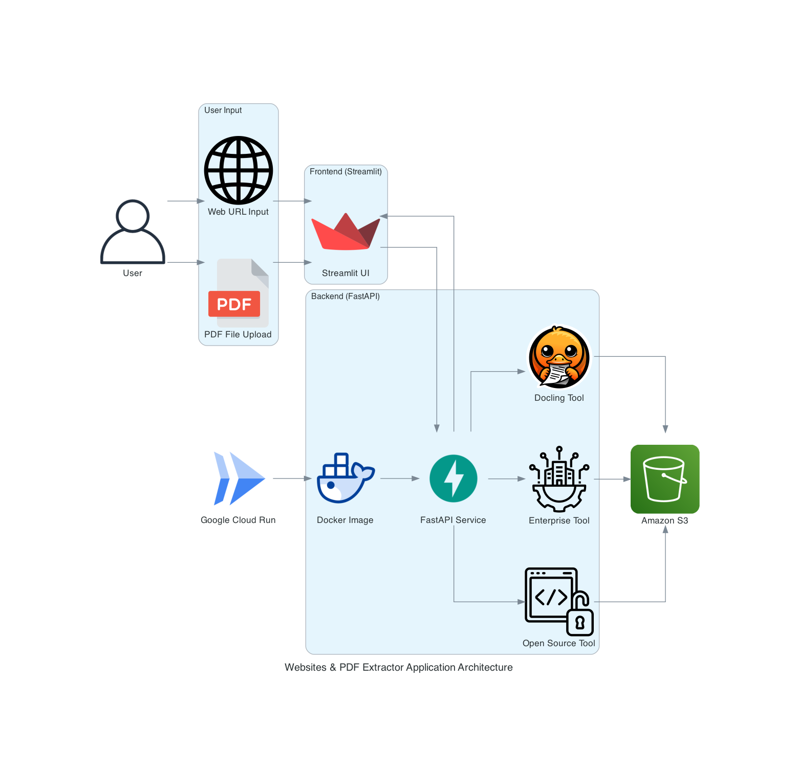

# Web & PDF Data Extraction Tool

The project focuses on developing an application with Streamlit for the user interface and FastAPI for API endpoints, utilizing a Python backend. It processes website URLs and PDF files to extract structured data, including text, images, and tables, using various parsing techniques. The extracted data is securely stored in an AWS S3 bucket and rendered in the Streamlit UI using a markdown-standardized format for consistency. The implementation integrates open-source libraries and enterprise tools, alongside document-linguistic approaches, to evaluate tool compatibility and performance. This prototype serves as a scalable framework for testing and validating data extraction capabilities across diverse input formats.

## Team Members

- Vedant Mane
- Abhinav Gangurde
- Yohan Markose

## Attestation:

WE ATTEST THAT WE HAVEN’T USED ANY OTHER STUDENTS’ WORK IN OUR ASSIGNMENT AND ABIDE BY THE POLICIES LISTED IN THE STUDENT HANDBOOK

## Application Workflow Diagram



## Environment Setup

```
Required Python Version 3.12.*
```

### 1. Clone the Repository

```bash
git clone https://github.com/BigDataIA-Spring2025-4/DAMG7245_Assignment01.git
cd DAMG7245_Assignment01
```

### 2. Setting up the virtual environment

```bash
python -m venv venvsource venv/bin/activate
pip install -r requirements.txt
```

### 3. AWS S3 Setup

**Step 1: Create an AWS Account**

- Go to [AWS Signup](https://aws.amazon.com/) and click **Create an AWS Account**.
- Follow the instructions to enter your email, password, and billing details.
- Verify your identity and choose a support plan.

**Step 2: Log in to AWS Management Console**

- Visit [AWS Console](https://aws.amazon.com/console/) and log in with your credentials.
- Search for **S3** in the AWS services search bar and open it.

**Step 3: Create an S3 Bucket**

- Click **Create bucket**.
- Enter a unique **Bucket name**.
- Select a region closest to your users.
- Configure settings as needed (e.g., versioning, encryption).
- Click **Create bucket** to finalize.

### 4. Google Cloud SDK Setup

**Step 1: Download and Install Google Cloud SDK**

- Visit the [Google Cloud SDK documentation](https://cloud.google.com/sdk/docs/install) for platform-specific installation instructions.
- Download the installer for your operating system (Windows, macOS, or Linux).
- Follow the installation steps provided for your system.

**Step 2: Initialize Google Cloud SDK**

- Open a terminal or command prompt.
- Run `gcloud init` to begin the setup process.
- Follow the prompts to log in with your Google account and select a project.

**Step 3: Verify Installation**

- Run `gcloud --version` to confirm installation.
- Use `gcloud config list` to check the active configuration.

### 5. Setting up the Docker Image

1. **Build the Docker Image**

```docker
# Build and tag your image (make sure you're in the project directory)
docker build --platform=linux/amd64 --no-cache -t gcr.io/<YOUR_PROJECT_ID>/fastapi-app .

```

2. **Test Locally (Optional but Recommended)**

```docker
# Run the container locally
docker run -p 8080:8080 gcr.io/<YOUR_PROJECT_ID>/fastapi-app

# For Managing Environment Variables
docker run --env-file .env -p 8080:8080 gcr.io/<YOUR_PROJECT_ID>/fastapi-app
```

Visit http://localhost:8080/docs to verify the API works.

3. **Push to Google Container Registry**

```docker
# Push the image
docker push gcr.io/<YOUR_PROJECT_ID>/fastapi-app
```

4. **Deploy to Cloud Run**

```bash
gcloud run deploy fastapi-service \
  --image gcr.io/<YOUR_PROJECT_ID>/fastapi-app \
  --platform managed \
  --region us-central1 \
  --allow-unauthenticated  
```

5. Get your Service URL

```bash
gcloud run services describe fastapi-service \
  --platform managed \
  --region <REGION> \
  --format 'value(status.url)'
```

6. Check Application Logs

```bash
gcloud run services logs read fastapi-service --region <REGION>
```


## References

[Streamlit documentation](https://docs.streamlit.io/)

[FastAPI Documentation](https://fastapi.tiangolo.com/)

[Scrapy Documentation](https://docs.scrapy.org/en/latest/)

[PyMuPDF Documentation](https://pymupdf.readthedocs.io/en/latest/)

[Diffbot Documentation](https://docs.diffbot.com/reference/introduction-to-diffbot-apis)

[Microsoft Document Intelligence Documentation](https://learn.microsoft.com/en-us/azure/ai-services/document-intelligence/?view=doc-intel-4.0.0)

[Docling Documentation](https://ds4sd.github.io/docling/)

