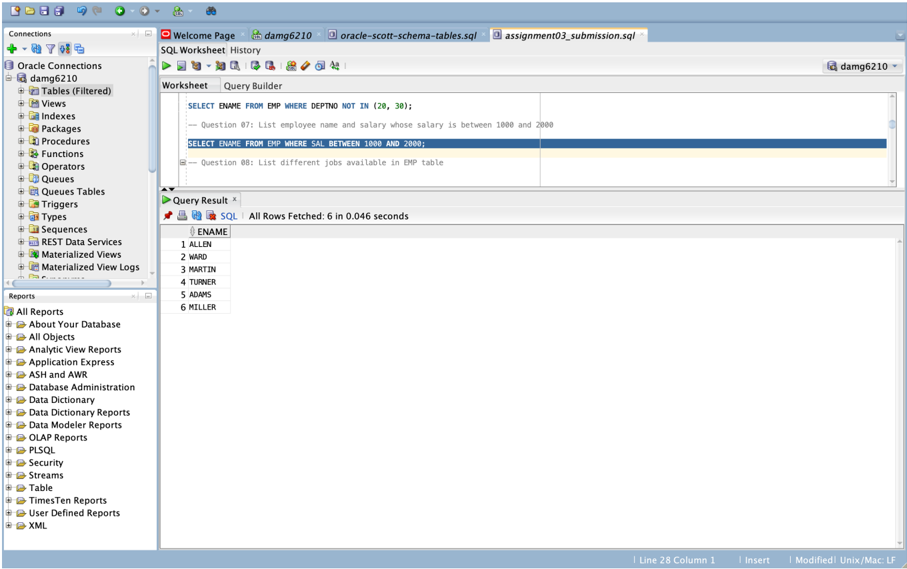

## Assignment 03 - Basic SQL

Using the EMP and DEPT table (where ever applicable) that were created as part of workshop session Answer the following questions.

oracle-scott-schema-tables.sql

sqlServer-scott-schema-tables.sql

## Questions

## Oracle SQL

- List name and salary of employees whose salary is more than 1000

SELECT ENAME, SAL FROM EMP

WHERE SAL > 1000;


- List names of CLERK's working in department 20

SELECT ENAME FROM EMP WHERE JOB='CLERK' and DEPTNO=20;


- List employee names of job type analysts, salesmen

SELECT ENAME FROM EMP

WHERE JOB IN ('ANALYST', 'SALESMAN');


- List names of employees who are not managers

SELECT EMPNO, ENAME FROM EMP WHERE EMPNO NOT IN ( SELECT MGR FROM EMP WHERE MGR IS NOT NULL);


- List name of employees whose employee numbers are 7369, 7521, 7934, 7788

SELECT ENAME FROM EMP

```
WHERE EMPNO IN (7369, 7521, 7934, 7788);
```


- List employee names who doesn't belong to department 20, 30

SELECT ENAME FROM EMP

WHERE DEPTNO NOT IN (20, 30);


- List employee name and salary whose salary is between 1000 and 2000

SELECT ENAME FROM EMP WHERE SAL BETWEEN 1000 AND 2000;



- List different jobs available in EMP table

SELECT DISTINCT JOB FROM EMP;


## List department names and locations from DEPT table

SELECT DNAME, LOC FROM DEPT;


- List employee names who have joined during the period of 30th June 1981 and 31st December 1981

SELECT ENAME FROM EMP WHERE HIREDATE BETWEEN '30-JUN-81' AND '31-DEC-81';


- List employees whose names start with capital "S"

```
SELECT ENAME FROM EMP WHERE ENAME LIKE 'S%';
```


- List names of employee having "I" as second character

SELECT ENAME FROM EMP WHERE ENAME LIKE '\_I%';


- List name, sal and Calculate 10% bonus amount based on their salary for each employee

SELECT ENAME, SAL, SAL * 0.1 as BONUS FROM EMP;


- Using catalog tables, generate an output which displays tablename, column name, datatype and its width of all the tables that are available under the user that you logged in. Expected to see the details of tables EMP, DEPT and SALGRADE

SELECT TABLE\_NAME, COLUMN\_NAME, DATA\_TYPE, DATA\_LENGTH FROM USER\_TAB\_COLUMNS;


- List details from table emp where ename ends with 'H' and contains 5 characters.

SELECT * FROM EMP

WHERE ENAME LIKE '\_\_\_\_H';


- List details of the employee's who joined on 3rd December, 1981.

SELECT * FROM EMP

WHERE HIREDATE='03-DEC-81';


- Write an SQL statement to print current database server date and time along with logged in username Hint: use USER for oracle and CURRENT\_USER for SQL Server / sysdate for oracle and getdate() for SQL Server)

SELECT USER,

```
TO\_CHAR(SYSDATE, 'DD-MON-YYYY HH24:MI:SS') AS CURRENT\_DATE FROM DUAL;
```


- List all employee names which has a character '\_' Underscore)

SELECT ENAME FROM EMP WHERE ENAME LIKE '%\_%' ESCAPE '\';


- List employee names who belongs to department 20 and 30 with salary greater than 1500

SELECT ENAME FROM EMP

WHERE DEPTNO IN (20,30) AND SAL > 1500;


- List all department names and locations. Available in table DEPT

SELECT DNAME, LOC FROM DEPT;

